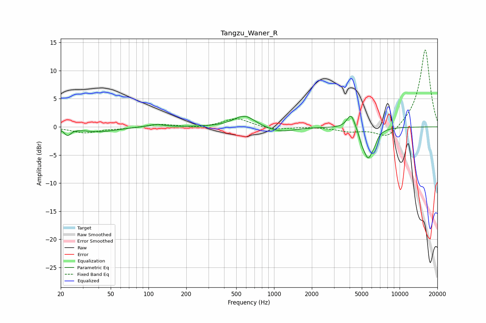

# Tangzu_Waner_R
See [usage instructions](https://github.com/jaakkopasanen/AutoEq#usage) for more options and info.

### Parametric EQs
Apply preamp of -2.0 dB when using parametric equalizer.

|   # | Type    |   Fc (Hz) |    Q |   Gain (dB) |
|-----|---------|-----------|------|-------------|
|   1 | Peaking |        23 | 5.49 |        -1.2 |
|   2 | Peaking |        40 | 1.07 |        -0.9 |
|   3 | Peaking |       114 | 2.25 |         0.5 |
|   4 | Peaking |       570 | 1.65 |         1.7 |
|   5 | Peaking |       613 | 1.97 |         0.4 |
|   6 | Peaking |      1113 | 1.26 |        -1   |
|   7 | Peaking |      4106 | 4.2  |         2.8 |
|   8 | Peaking |      5001 | 6    |        -1.1 |
|   9 | Peaking |      5612 | 3.61 |        -5.2 |
|  10 | Peaking |      6296 | 6    |        -1   |

### Fixed Band EQs
When using fixed band (also called graphic) equalizer, apply preamp of **-13.8 dB** (if available) and set gains manually with these parameters.

|   # | Type    |   Fc (Hz) |    Q |   Gain (dB) |
|-----|---------|-----------|------|-------------|
|   1 | Peaking |        31 | 1.41 |        -1   |
|   2 | Peaking |        62 | 1.41 |        -0.2 |
|   3 | Peaking |       125 | 1.41 |         0.5 |
|   4 | Peaking |       250 | 1.41 |        -0.3 |
|   5 | Peaking |       500 | 1.41 |         1.6 |
|   6 | Peaking |      1000 | 1.41 |        -0.6 |
|   7 | Peaking |      2000 | 1.41 |         0   |
|   8 | Peaking |      4000 | 1.41 |        -0.8 |
|   9 | Peaking |      8000 | 1.41 |        -2.3 |
|  10 | Peaking |     16000 | 1.41 |        13.9 |

### Graphs

