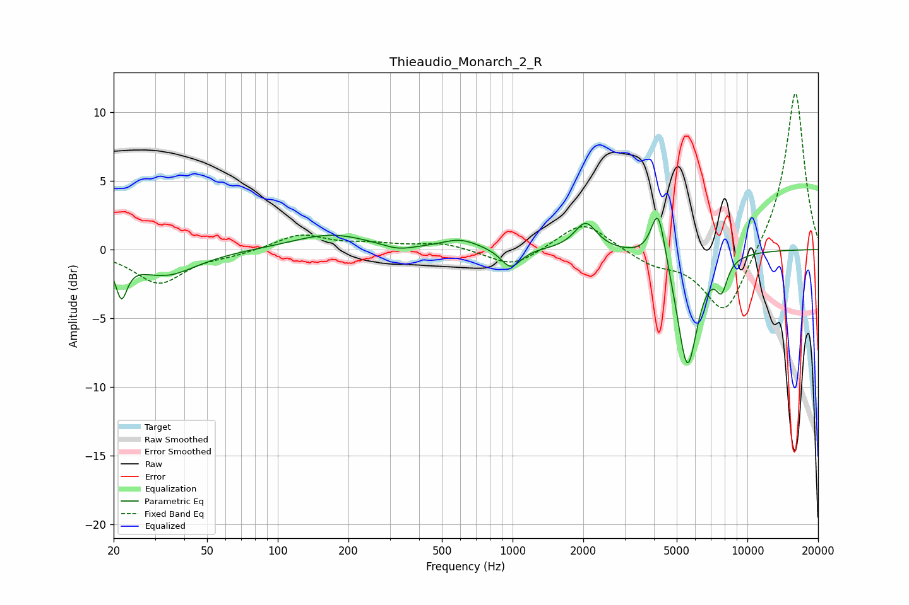

# Thieaudio_Monarch_2_R
See [usage instructions](https://github.com/jaakkopasanen/AutoEq#usage) for more options and info.

### Parametric EQs
Apply preamp of -2.4 dB when using parametric equalizer.

|   # | Type    |   Fc (Hz) |    Q |   Gain (dB) |
|-----|---------|-----------|------|-------------|
|   1 | Peaking |        22 | 5.98 |        -2.7 |
|   2 | Peaking |        33 | 1.06 |        -1.9 |
|   3 | Peaking |       168 | 0.88 |         1.1 |
|   4 | Peaking |       325 | 2.12 |        -0.4 |
|   5 | Peaking |       598 | 1.81 |         0.7 |
|   6 | Peaking |       983 | 3.37 |        -1.5 |
|   7 | Peaking |      2047 | 3    |         2   |
|   8 | Peaking |      4170 | 4.59 |         4.1 |
|   9 | Peaking |      5549 | 3.13 |        -8.6 |
|  10 | Peaking |      7765 | 5.38 |        -2   |

### Fixed Band EQs
When using fixed band (also called graphic) equalizer, apply preamp of **-11.5 dB** (if available) and set gains manually with these parameters.

|   # | Type    |   Fc (Hz) |    Q |   Gain (dB) |
|-----|---------|-----------|------|-------------|
|   1 | Peaking |        31 | 1.41 |        -2.4 |
|   2 | Peaking |        62 | 1.41 |        -0.3 |
|   3 | Peaking |       125 | 1.41 |         1.1 |
|   4 | Peaking |       250 | 1.41 |         0.3 |
|   5 | Peaking |       500 | 1.41 |         0.5 |
|   6 | Peaking |      1000 | 1.41 |        -1.3 |
|   7 | Peaking |      2000 | 1.41 |         2.2 |
|   8 | Peaking |      4000 | 1.41 |        -1   |
|   9 | Peaking |      8000 | 1.41 |        -4.9 |
|  10 | Peaking |     16000 | 1.41 |        11.7 |

### Graphs

