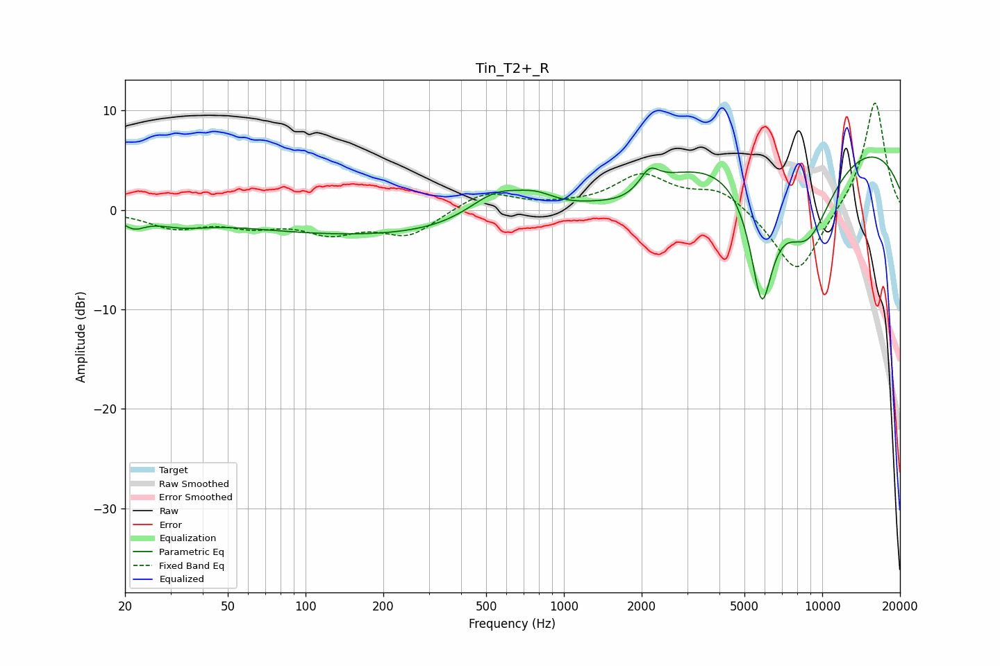

# Tin_T2+_R
See [usage instructions](https://github.com/jaakkopasanen/AutoEq#usage) for more options and info.

### Parametric EQs
Apply preamp of -5.4 dB when using parametric equalizer.

|   # | Type    |   Fc (Hz) |    Q |   Gain (dB) |
|-----|---------|-----------|------|-------------|
|   1 | Peaking |        22 | 3.37 |        -1.1 |
|   2 | Peaking |        33 | 1.41 |        -0.9 |
|   3 | Peaking |       279 | 0.18 |        -2.8 |
|   4 | Peaking |       547 | 1.23 |         3.2 |
|   5 | Peaking |       781 | 1.81 |         1.3 |
|   6 | Peaking |      1782 | 1.28 |        -1.5 |
|   7 | Peaking |      2142 | 3.79 |         2   |
|   8 | Peaking |      5831 | 2.89 |       -12.4 |
|   9 | Peaking |      8688 | 0.19 |         8.3 |
|  10 | Peaking |      8739 | 1.1  |        -9.6 |

### Fixed Band EQs
When using fixed band (also called graphic) equalizer, apply preamp of **-10.9 dB** (if available) and set gains manually with these parameters.

|   # | Type    |   Fc (Hz) |    Q |   Gain (dB) |
|-----|---------|-----------|------|-------------|
|   1 | Peaking |        31 | 1.41 |        -1.7 |
|   2 | Peaking |        62 | 1.41 |        -1.3 |
|   3 | Peaking |       125 | 1.41 |        -2   |
|   4 | Peaking |       250 | 1.41 |        -2.5 |
|   5 | Peaking |       500 | 1.41 |         1.9 |
|   6 | Peaking |      1000 | 1.41 |         0.2 |
|   7 | Peaking |      2000 | 1.41 |         3.4 |
|   8 | Peaking |      4000 | 1.41 |         2.1 |
|   9 | Peaking |      8000 | 1.41 |        -6.8 |
|  10 | Peaking |     16000 | 1.41 |        11.2 |

### Graphs

