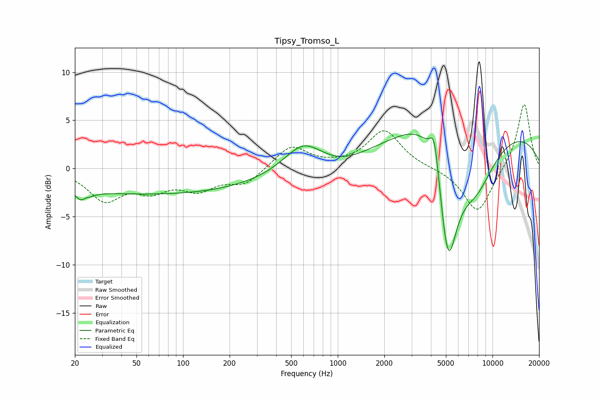

# Tipsy_Tromso_L
See [usage instructions](https://github.com/jaakkopasanen/AutoEq#usage) for more options and info.

### Parametric EQs
Apply preamp of -3.7 dB when using parametric equalizer.

|   # | Type    |   Fc (Hz) |    Q |   Gain (dB) |
|-----|---------|-----------|------|-------------|
|   1 | Peaking |        23 | 3.97 |        -2.8 |
|   2 | Peaking |        23 | 5    |         1.9 |
|   3 | Peaking |        65 | 0.18 |        -2.7 |
|   4 | Peaking |       599 | 1.16 |         2.8 |
|   5 | Peaking |      1075 | 0.88 |        -0.9 |
|   6 | Peaking |      3654 | 1.05 |         2.7 |
|   7 | Peaking |      4211 | 4.65 |         4.1 |
|   8 | Peaking |      5159 | 2.15 |       -12.5 |
|   9 | Peaking |      7644 | 0.19 |         4.6 |
|  10 | Peaking |      7769 | 1    |        -5.4 |

### Fixed Band EQs
When using fixed band (also called graphic) equalizer, apply preamp of **-6.7 dB** (if available) and set gains manually with these parameters.

|   # | Type    |   Fc (Hz) |    Q |   Gain (dB) |
|-----|---------|-----------|------|-------------|
|   1 | Peaking |        31 | 1.41 |        -3.1 |
|   2 | Peaking |        62 | 1.41 |        -1.9 |
|   3 | Peaking |       125 | 1.41 |        -1.9 |
|   4 | Peaking |       250 | 1.41 |        -1.6 |
|   5 | Peaking |       500 | 1.41 |         2.4 |
|   6 | Peaking |      1000 | 1.41 |         0.2 |
|   7 | Peaking |      2000 | 1.41 |         3.9 |
|   8 | Peaking |      4000 | 1.41 |         0   |
|   9 | Peaking |      8000 | 1.41 |        -4.7 |
|  10 | Peaking |     16000 | 1.41 |         6.9 |

### Graphs

