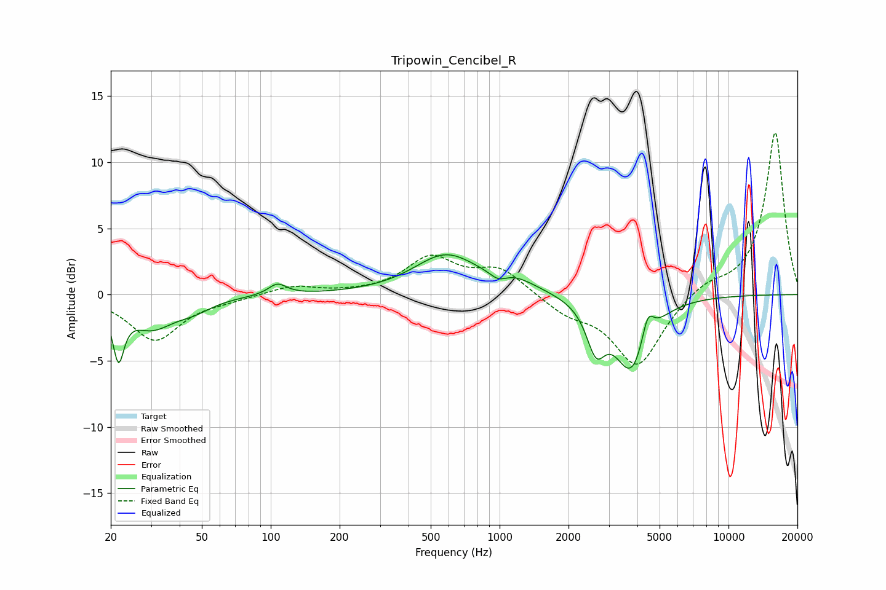

# Tripowin_Cencibel_R
See [usage instructions](https://github.com/jaakkopasanen/AutoEq#usage) for more options and info.

### Parametric EQs
Apply preamp of -3.1 dB when using parametric equalizer.

|   # | Type    |   Fc (Hz) |    Q |   Gain (dB) |
|-----|---------|-----------|------|-------------|
|   1 | Peaking |        22 | 5.98 |        -3.9 |
|   2 | Peaking |        30 | 1.47 |        -2.3 |
|   3 | Peaking |        46 | 1.74 |        -0.8 |
|   4 | Peaking |       107 | 3.58 |         0.8 |
|   5 | Peaking |       581 | 1.03 |         2.9 |
|   6 | Peaking |       987 | 3.72 |        -0.7 |
|   7 | Peaking |      1141 | 1.39 |         0.9 |
|   8 | Peaking |      2636 | 3.47 |        -3.2 |
|   9 | Peaking |      3778 | 1.91 |        -5.7 |
|  10 | Peaking |      4434 | 5.32 |         2.2 |

### Fixed Band EQs
When using fixed band (also called graphic) equalizer, apply preamp of **-12.3 dB** (if available) and set gains manually with these parameters.

|   # | Type    |   Fc (Hz) |    Q |   Gain (dB) |
|-----|---------|-----------|------|-------------|
|   1 | Peaking |        31 | 1.41 |        -3.4 |
|   2 | Peaking |        62 | 1.41 |        -0.3 |
|   3 | Peaking |       125 | 1.41 |         0.7 |
|   4 | Peaking |       250 | 1.41 |         0   |
|   5 | Peaking |       500 | 1.41 |         2.7 |
|   6 | Peaking |      1000 | 1.41 |         1.9 |
|   7 | Peaking |      2000 | 1.41 |        -1.2 |
|   8 | Peaking |      4000 | 1.41 |        -5.4 |
|   9 | Peaking |      8000 | 1.41 |         0.9 |
|  10 | Peaking |     16000 | 1.41 |        12.3 |

### Graphs

