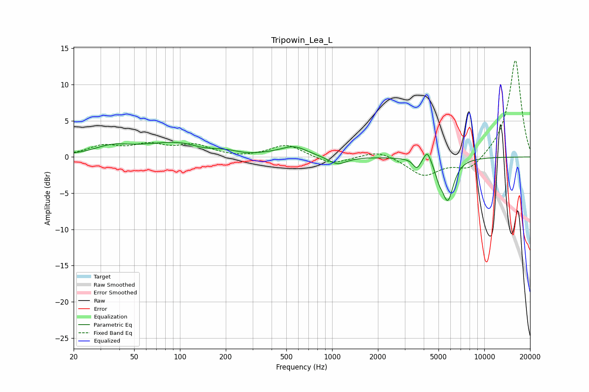

# Tripowin_Lea_L
See [usage instructions](https://github.com/jaakkopasanen/AutoEq#usage) for more options and info.

### Parametric EQs
Apply preamp of -2.1 dB when using parametric equalizer.

|   # | Type    |   Fc (Hz) |    Q |   Gain (dB) |
|-----|---------|-----------|------|-------------|
|   1 | Peaking |        36 | 1.27 |         1   |
|   2 | Peaking |       103 | 0.54 |         2.1 |
|   3 | Peaking |       142 | 1.75 |        -0.6 |
|   4 | Peaking |       278 | 1.99 |        -0.3 |
|   5 | Peaking |       560 | 1.63 |         1.3 |
|   6 | Peaking |      1081 | 2.33 |        -1.2 |
|   7 | Peaking |      3598 | 5.97 |        -1.3 |
|   8 | Peaking |      4225 | 5.99 |         1.7 |
|   9 | Peaking |      5033 | 6    |        -1.3 |
|  10 | Peaking |      5749 | 3.59 |        -5.8 |

### Fixed Band EQs
When using fixed band (also called graphic) equalizer, apply preamp of **-13.4 dB** (if available) and set gains manually with these parameters.

|   # | Type    |   Fc (Hz) |    Q |   Gain (dB) |
|-----|---------|-----------|------|-------------|
|   1 | Peaking |        31 | 1.41 |         1.4 |
|   2 | Peaking |        62 | 1.41 |         1.5 |
|   3 | Peaking |       125 | 1.41 |         1.5 |
|   4 | Peaking |       250 | 1.41 |        -0.2 |
|   5 | Peaking |       500 | 1.41 |         1.7 |
|   6 | Peaking |      1000 | 1.41 |        -1.1 |
|   7 | Peaking |      2000 | 1.41 |         1   |
|   8 | Peaking |      4000 | 1.41 |        -2.6 |
|   9 | Peaking |      8000 | 1.41 |        -2   |
|  10 | Peaking |     16000 | 1.41 |        13.5 |

### Graphs

