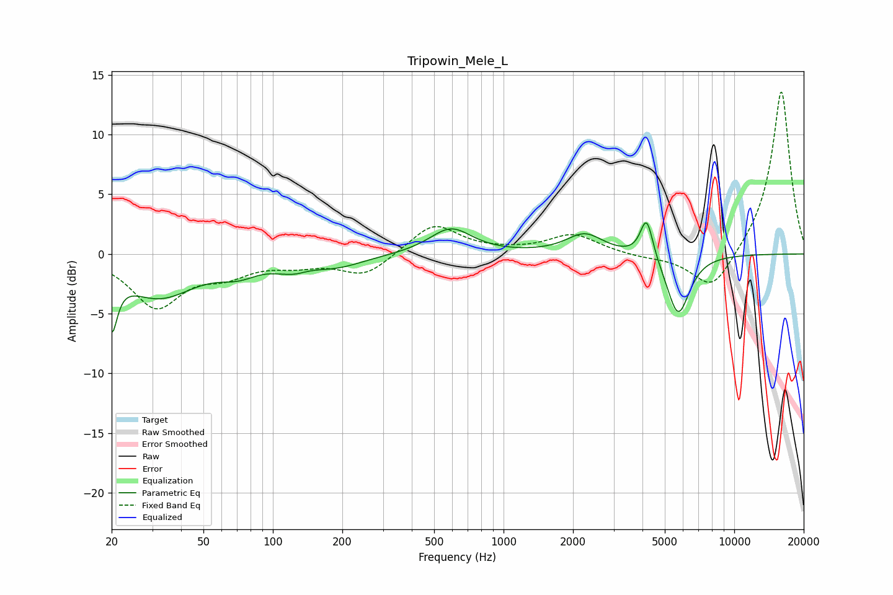

# Tripowin_Mele_L
See [usage instructions](https://github.com/jaakkopasanen/AutoEq#usage) for more options and info.

### Parametric EQs
Apply preamp of -2.7 dB when using parametric equalizer.

|   # | Type    |   Fc (Hz) |    Q |   Gain (dB) |
|-----|---------|-----------|------|-------------|
|   1 | Peaking |        20 | 5.97 |        -4.6 |
|   2 | Peaking |        32 | 0.9  |        -3.5 |
|   3 | Peaking |        71 | 1.66 |        -1   |
|   4 | Peaking |       117 | 3.15 |         0.9 |
|   5 | Peaking |       117 | 2.61 |        -1.6 |
|   6 | Peaking |       188 | 1.15 |        -1   |
|   7 | Peaking |       591 | 1.56 |         2.2 |
|   8 | Peaking |      2250 | 1.78 |         1.7 |
|   9 | Peaking |      4171 | 5.1  |         3.4 |
|  10 | Peaking |      5712 | 2.81 |        -5.2 |

### Fixed Band EQs
When using fixed band (also called graphic) equalizer, apply preamp of **-13.7 dB** (if available) and set gains manually with these parameters.

|   # | Type    |   Fc (Hz) |    Q |   Gain (dB) |
|-----|---------|-----------|------|-------------|
|   1 | Peaking |        31 | 1.41 |        -4.3 |
|   2 | Peaking |        62 | 1.41 |        -1.4 |
|   3 | Peaking |       125 | 1.41 |        -0.7 |
|   4 | Peaking |       250 | 1.41 |        -1.8 |
|   5 | Peaking |       500 | 1.41 |         2.6 |
|   6 | Peaking |      1000 | 1.41 |         0.1 |
|   7 | Peaking |      2000 | 1.41 |         1.6 |
|   8 | Peaking |      4000 | 1.41 |        -0.3 |
|   9 | Peaking |      8000 | 1.41 |        -3.3 |
|  10 | Peaking |     16000 | 1.41 |        13.8 |

### Graphs

