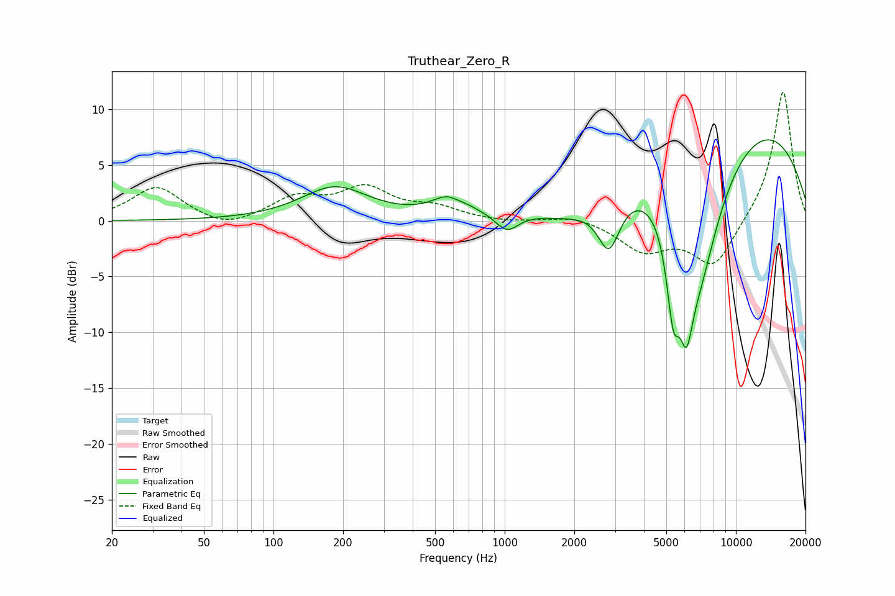

# Truthear_Zero_R
See [usage instructions](https://github.com/jaakkopasanen/AutoEq#usage) for more options and info.

### Parametric EQs
Apply preamp of -7.4 dB when using parametric equalizer.

|   # | Type    |   Fc (Hz) |    Q |   Gain (dB) |
|-----|---------|-----------|------|-------------|
|   1 | Peaking |       184 | 0.98 |         3   |
|   2 | Peaking |       584 | 1.93 |         1.8 |
|   3 | Peaking |       622 | 4.08 |        -0.3 |
|   4 | Peaking |      1022 | 2.78 |        -1.7 |
|   5 | Peaking |      1977 | 0.79 |        -3   |
|   6 | Peaking |      2825 | 2.9  |        -4.7 |
|   7 | Peaking |      5359 | 4.66 |        -7.5 |
|   8 | Peaking |      6110 | 4.67 |        -6.3 |
|   9 | Peaking |      6890 | 1.03 |       -15.5 |
|  10 | Peaking |      8289 | 0.25 |        12.7 |

### Fixed Band EQs
When using fixed band (also called graphic) equalizer, apply preamp of **-11.6 dB** (if available) and set gains manually with these parameters.

|   # | Type    |   Fc (Hz) |    Q |   Gain (dB) |
|-----|---------|-----------|------|-------------|
|   1 | Peaking |        31 | 1.41 |         3   |
|   2 | Peaking |        62 | 1.41 |        -0.9 |
|   3 | Peaking |       125 | 1.41 |         1.9 |
|   4 | Peaking |       250 | 1.41 |         2.7 |
|   5 | Peaking |       500 | 1.41 |         1   |
|   6 | Peaking |      1000 | 1.41 |        -0.2 |
|   7 | Peaking |      2000 | 1.41 |         0.6 |
|   8 | Peaking |      4000 | 1.41 |        -2.6 |
|   9 | Peaking |      8000 | 1.41 |        -4.2 |
|  10 | Peaking |     16000 | 1.41 |        11.8 |

### Graphs

