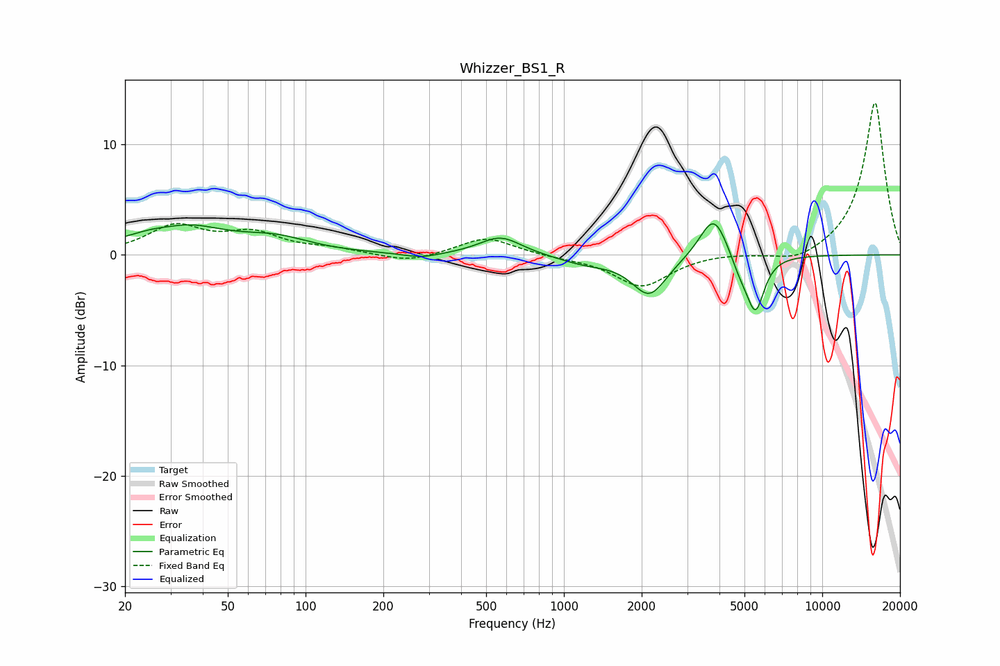

# Whizzer_BS1_R
See [usage instructions](https://github.com/jaakkopasanen/AutoEq#usage) for more options and info.

### Parametric EQs
Apply preamp of -2.9 dB when using parametric equalizer.

|   # | Type    |   Fc (Hz) |    Q |   Gain (dB) |
|-----|---------|-----------|------|-------------|
|   1 | Peaking |        30 | 2.14 |        -0.4 |
|   2 | Peaking |        32 | 0.85 |         2.8 |
|   3 | Peaking |        77 | 1.06 |         1.2 |
|   4 | Peaking |       281 | 1.99 |        -0.4 |
|   5 | Peaking |       568 | 1.73 |         1.7 |
|   6 | Peaking |      1220 | 1.31 |        -0.7 |
|   7 | Peaking |      2143 | 2.08 |        -3.6 |
|   8 | Peaking |      3805 | 2.61 |         4.1 |
|   9 | Peaking |      4814 | 3.72 |        -1.5 |
|  10 | Peaking |      5515 | 4.04 |        -4.9 |

### Fixed Band EQs
When using fixed band (also called graphic) equalizer, apply preamp of **-13.9 dB** (if available) and set gains manually with these parameters.

|   # | Type    |   Fc (Hz) |    Q |   Gain (dB) |
|-----|---------|-----------|------|-------------|
|   1 | Peaking |        31 | 1.41 |         2.5 |
|   2 | Peaking |        62 | 1.41 |         1.8 |
|   3 | Peaking |       125 | 1.41 |         0.5 |
|   4 | Peaking |       250 | 1.41 |        -0.7 |
|   5 | Peaking |       500 | 1.41 |         1.6 |
|   6 | Peaking |      1000 | 1.41 |        -0.2 |
|   7 | Peaking |      2000 | 1.41 |        -2.9 |
|   8 | Peaking |      4000 | 1.41 |         0.2 |
|   9 | Peaking |      8000 | 1.41 |        -0.9 |
|  10 | Peaking |     16000 | 1.41 |        13.9 |

### Graphs

