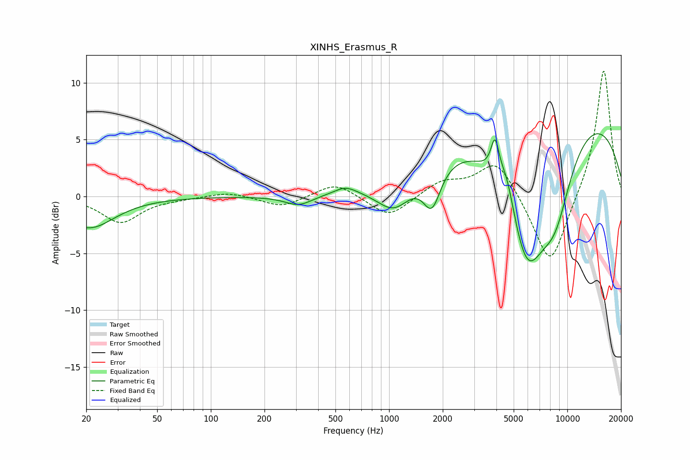

# XINHS_Erasmus_R
See [usage instructions](https://github.com/jaakkopasanen/AutoEq#usage) for more options and info.

### Parametric EQs
Apply preamp of -5.6 dB when using parametric equalizer.

|   # | Type    |   Fc (Hz) |    Q |   Gain (dB) |
|-----|---------|-----------|------|-------------|
|   1 | Peaking |        21 | 1    |        -2.8 |
|   2 | Peaking |       311 | 1.83 |        -0.9 |
|   3 | Peaking |       569 | 2.3  |         0.7 |
|   4 | Peaking |      1070 | 1.39 |        -2.9 |
|   5 | Peaking |      1739 | 2.85 |        -3.6 |
|   6 | Peaking |      3931 | 5.98 |         3.2 |
|   7 | Peaking |      4582 | 3.34 |         2.4 |
|   8 | Peaking |      5926 | 1.07 |       -12.3 |
|   9 | Peaking |      7858 | 0.19 |         8.9 |
|  10 | Peaking |      8542 | 1.35 |        -5.7 |

### Fixed Band EQs
When using fixed band (also called graphic) equalizer, apply preamp of **-11.1 dB** (if available) and set gains manually with these parameters.

|   # | Type    |   Fc (Hz) |    Q |   Gain (dB) |
|-----|---------|-----------|------|-------------|
|   1 | Peaking |        31 | 1.41 |        -2.3 |
|   2 | Peaking |        62 | 1.41 |        -0.1 |
|   3 | Peaking |       125 | 1.41 |         0.4 |
|   4 | Peaking |       250 | 1.41 |        -1   |
|   5 | Peaking |       500 | 1.41 |         1.3 |
|   6 | Peaking |      1000 | 1.41 |        -1.9 |
|   7 | Peaking |      2000 | 1.41 |         1.3 |
|   8 | Peaking |      4000 | 1.41 |         3.3 |
|   9 | Peaking |      8000 | 1.41 |        -6.4 |
|  10 | Peaking |     16000 | 1.41 |        11.4 |

### Graphs

