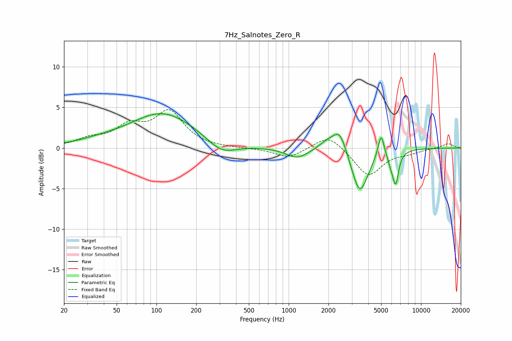

# 7Hz_Salnotes_Zero_R
See [usage instructions](https://github.com/jaakkopasanen/AutoEq#usage) for more options and info.

### Parametric EQs
Apply preamp of -4.3 dB when using parametric equalizer.

|   # | Type    |   Fc (Hz) |    Q |   Gain (dB) |
|-----|---------|-----------|------|-------------|
|   1 | Peaking |        36 | 0.81 |         0.4 |
|   2 | Peaking |       112 | 0.57 |         4.3 |
|   3 | Peaking |       310 | 1.3  |        -1.6 |
|   4 | Peaking |      1158 | 1.71 |        -1.2 |
|   5 | Peaking |      1939 | 2.44 |         0.9 |
|   6 | Peaking |      2431 | 2.66 |         2.8 |
|   7 | Peaking |      3447 | 2.26 |        -5.7 |
|   8 | Peaking |      4994 | 6    |         2.9 |
|   9 | Peaking |      5880 | 6    |        -0.9 |
|  10 | Peaking |      6429 | 6    |        -3.9 |

### Fixed Band EQs
When using fixed band (also called graphic) equalizer, apply preamp of **-4.8 dB** (if available) and set gains manually with these parameters.

|   # | Type    |   Fc (Hz) |    Q |   Gain (dB) |
|-----|---------|-----------|------|-------------|
|   1 | Peaking |        31 | 1.41 |         0.9 |
|   2 | Peaking |        62 | 1.41 |         2.4 |
|   3 | Peaking |       125 | 1.41 |         4.3 |
|   4 | Peaking |       250 | 1.41 |        -0   |
|   5 | Peaking |       500 | 1.41 |        -0.1 |
|   6 | Peaking |      1000 | 1.41 |        -1.2 |
|   7 | Peaking |      2000 | 1.41 |         1.8 |
|   8 | Peaking |      4000 | 1.41 |        -3.5 |
|   9 | Peaking |      8000 | 1.41 |        -0.5 |
|  10 | Peaking |     16000 | 1.41 |         0.6 |

### Graphs

