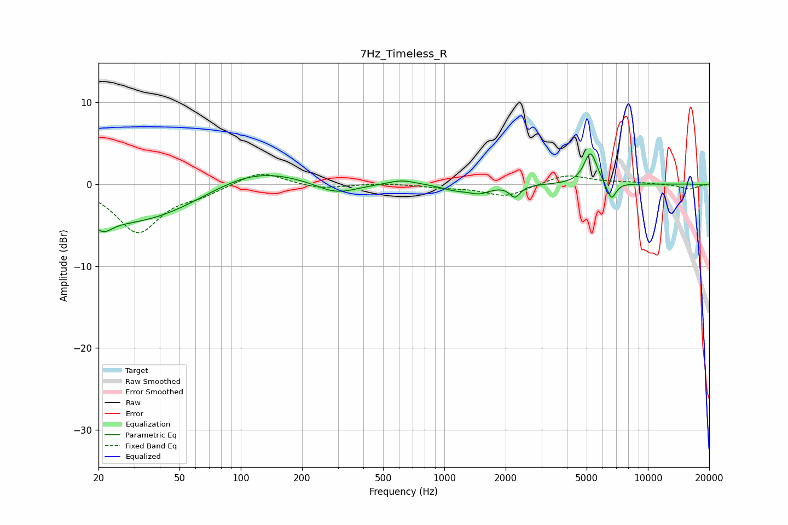

# 7Hz_Timeless_R
See [usage instructions](https://github.com/jaakkopasanen/AutoEq#usage) for more options and info.

### Parametric EQs
Apply preamp of -3.8 dB when using parametric equalizer.

|   # | Type    |   Fc (Hz) |    Q |   Gain (dB) |
|-----|---------|-----------|------|-------------|
|   1 | Peaking |        21 | 3.39 |        -1.5 |
|   2 | Peaking |        29 | 0.4  |        -4.9 |
|   3 | Peaking |       112 | 0.62 |         2.6 |
|   4 | Peaking |       294 | 1.38 |        -1.5 |
|   5 | Peaking |       617 | 2.09 |         0.6 |
|   6 | Peaking |      1119 | 2.2  |        -0.6 |
|   7 | Peaking |      1483 | 2.61 |        -0.9 |
|   8 | Peaking |      2222 | 5.62 |        -1.4 |
|   9 | Peaking |      5225 | 4.38 |         3.9 |
|  10 | Peaking |      6611 | 6    |        -2.2 |

### Fixed Band EQs
When using fixed band (also called graphic) equalizer, apply preamp of **-1.3 dB** (if available) and set gains manually with these parameters.

|   # | Type    |   Fc (Hz) |    Q |   Gain (dB) |
|-----|---------|-----------|------|-------------|
|   1 | Peaking |        31 | 1.41 |        -5.8 |
|   2 | Peaking |        62 | 1.41 |        -1   |
|   3 | Peaking |       125 | 1.41 |         1.7 |
|   4 | Peaking |       250 | 1.41 |        -0.6 |
|   5 | Peaking |       500 | 1.41 |         0.2 |
|   6 | Peaking |      1000 | 1.41 |        -0.3 |
|   7 | Peaking |      2000 | 1.41 |        -1.5 |
|   8 | Peaking |      4000 | 1.41 |         1.2 |
|   9 | Peaking |      8000 | 1.41 |         0.2 |
|  10 | Peaking |     16000 | 1.41 |        -0.6 |

### Graphs

