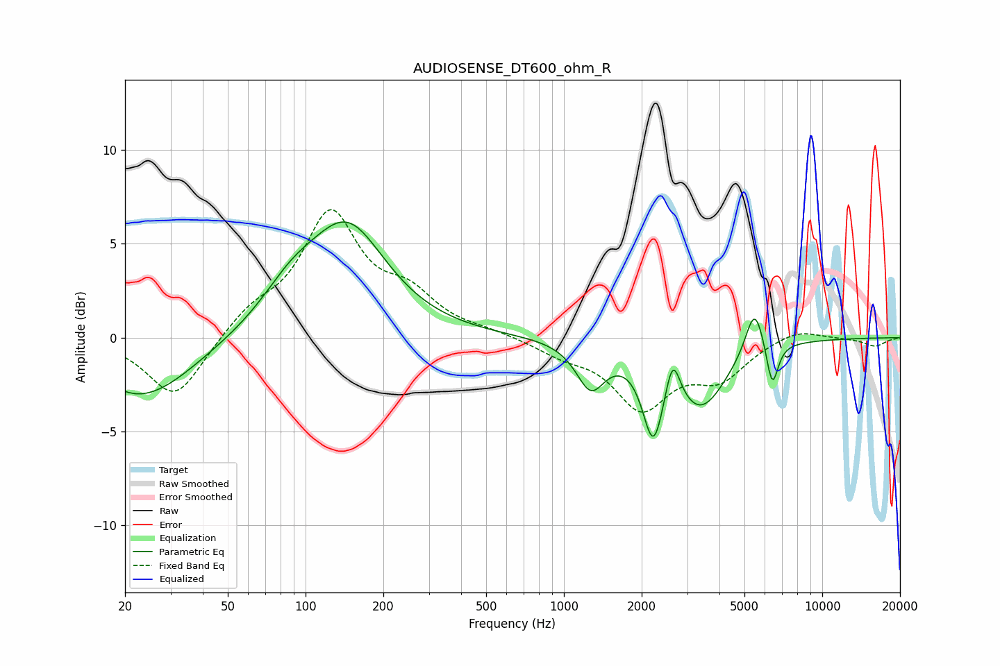

# AUDIOSENSE_DT600_ohm_R
See [usage instructions](https://github.com/jaakkopasanen/AutoEq#usage) for more options and info.

### Parametric EQs
Apply preamp of -6.3 dB when using parametric equalizer.

|   # | Type    |   Fc (Hz) |    Q |   Gain (dB) |
|-----|---------|-----------|------|-------------|
|   1 | Peaking |        22 | 3.25 |        -0.1 |
|   2 | Peaking |        24 | 0.73 |        -3.2 |
|   3 | Peaking |        88 | 1.23 |         1.7 |
|   4 | Peaking |       145 | 0.94 |         5.7 |
|   5 | Peaking |      1270 | 2.55 |        -2.4 |
|   6 | Peaking |      2218 | 3.55 |        -4.2 |
|   7 | Peaking |      2636 | 5.14 |         2.3 |
|   8 | Peaking |      3390 | 1.39 |        -3.5 |
|   9 | Peaking |      5473 | 3.88 |         2.6 |
|  10 | Peaking |      6404 | 6    |        -2.4 |

### Fixed Band EQs
When using fixed band (also called graphic) equalizer, apply preamp of **-6.9 dB** (if available) and set gains manually with these parameters.

|   # | Type    |   Fc (Hz) |    Q |   Gain (dB) |
|-----|---------|-----------|------|-------------|
|   1 | Peaking |        31 | 1.41 |        -3.3 |
|   2 | Peaking |        62 | 1.41 |         1.2 |
|   3 | Peaking |       125 | 1.41 |         6.4 |
|   4 | Peaking |       250 | 1.41 |         1.9 |
|   5 | Peaking |       500 | 1.41 |         0.2 |
|   6 | Peaking |      1000 | 1.41 |        -0.7 |
|   7 | Peaking |      2000 | 1.41 |        -3.5 |
|   8 | Peaking |      4000 | 1.41 |        -1.9 |
|   9 | Peaking |      8000 | 1.41 |         0.6 |
|  10 | Peaking |     16000 | 1.41 |        -0.5 |

### Graphs

