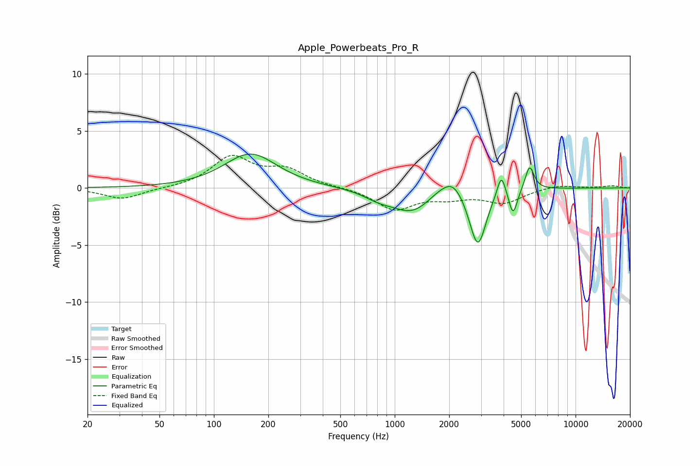

# Apple_Powerbeats_Pro_R
See [usage instructions](https://github.com/jaakkopasanen/AutoEq#usage) for more options and info.

### Parametric EQs
Apply preamp of -3.1 dB when using parametric equalizer.

|   # | Type    |   Fc (Hz) |    Q |   Gain (dB) |
|-----|---------|-----------|------|-------------|
|   1 | Peaking |       160 | 0.98 |         3   |
|   2 | Peaking |       813 | 1.78 |        -0.6 |
|   3 | Peaking |      1259 | 1.22 |        -2.1 |
|   4 | Peaking |      1713 | 1.9  |         0.5 |
|   5 | Peaking |      2099 | 2.24 |         1.5 |
|   6 | Peaking |      2745 | 2.57 |        -1   |
|   7 | Peaking |      2896 | 3.34 |        -4.2 |
|   8 | Peaking |      3888 | 6    |         2.1 |
|   9 | Peaking |      4512 | 6    |        -2.3 |
|  10 | Peaking |      5569 | 5.74 |         2.2 |

### Fixed Band EQs
When using fixed band (also called graphic) equalizer, apply preamp of **-3.0 dB** (if available) and set gains manually with these parameters.

|   # | Type    |   Fc (Hz) |    Q |   Gain (dB) |
|-----|---------|-----------|------|-------------|
|   1 | Peaking |        31 | 1.41 |        -1   |
|   2 | Peaking |        62 | 1.41 |        -0   |
|   3 | Peaking |       125 | 1.41 |         2.6 |
|   4 | Peaking |       250 | 1.41 |         1.5 |
|   5 | Peaking |       500 | 1.41 |         0   |
|   6 | Peaking |      1000 | 1.41 |        -1.8 |
|   7 | Peaking |      2000 | 1.41 |        -0.7 |
|   8 | Peaking |      4000 | 1.41 |        -1.2 |
|   9 | Peaking |      8000 | 1.41 |         0.3 |
|  10 | Peaking |     16000 | 1.41 |         0.2 |

### Graphs

