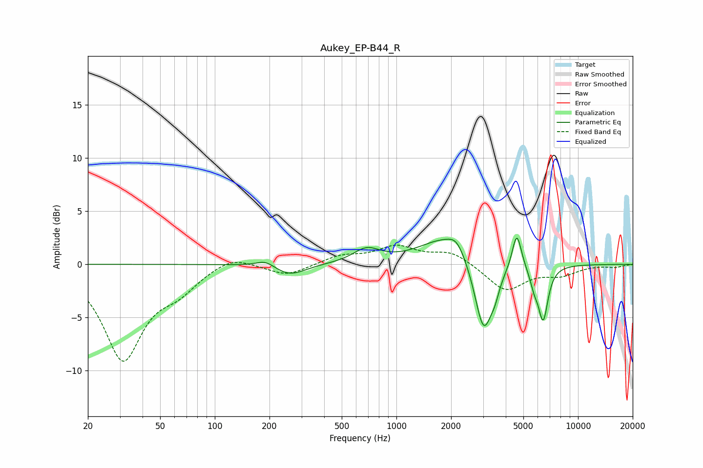

# Aukey_EP-B44_R
See [usage instructions](https://github.com/jaakkopasanen/AutoEq#usage) for more options and info.

### Parametric EQs
Apply preamp of -2.6 dB when using parametric equalizer.

|   # | Type    |   Fc (Hz) |    Q |   Gain (dB) |
|-----|---------|-----------|------|-------------|
|   1 | Peaking |       191 | 2.74 |         0.6 |
|   2 | Peaking |       258 | 1.64 |        -1.1 |
|   3 | Peaking |       685 | 1.94 |         1.3 |
|   4 | Peaking |      1843 | 1    |         2.4 |
|   5 | Peaking |      2151 | 3.05 |         1.2 |
|   6 | Peaking |      3022 | 2.83 |        -6.9 |
|   7 | Peaking |      3487 | 5.88 |        -1   |
|   8 | Peaking |      4601 | 5.49 |         3.5 |
|   9 | Peaking |      5731 | 6    |        -1.3 |
|  10 | Peaking |      6427 | 5.11 |        -5   |

### Fixed Band EQs
When using fixed band (also called graphic) equalizer, apply preamp of **-1.9 dB** (if available) and set gains manually with these parameters.

|   # | Type    |   Fc (Hz) |    Q |   Gain (dB) |
|-----|---------|-----------|------|-------------|
|   1 | Peaking |        31 | 1.41 |        -8.8 |
|   2 | Peaking |        62 | 1.41 |        -1.9 |
|   3 | Peaking |       125 | 1.41 |         1   |
|   4 | Peaking |       250 | 1.41 |        -1.1 |
|   5 | Peaking |       500 | 1.41 |         0.8 |
|   6 | Peaking |      1000 | 1.41 |         1.6 |
|   7 | Peaking |      2000 | 1.41 |         1.2 |
|   8 | Peaking |      4000 | 1.41 |        -2.5 |
|   9 | Peaking |      8000 | 1.41 |        -0.9 |
|  10 | Peaking |     16000 | 1.41 |        -0.2 |

### Graphs

