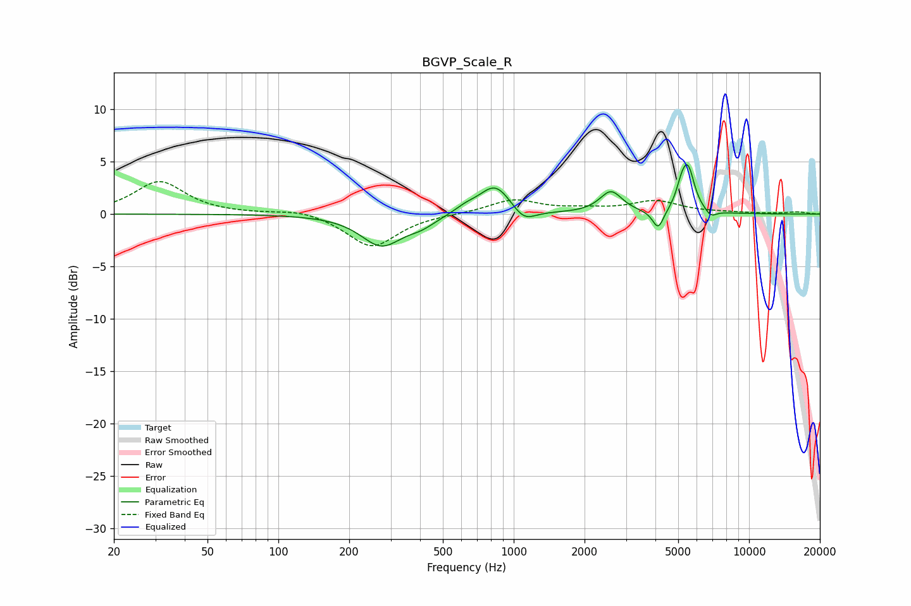

# BGVP_Scale_R
See [usage instructions](https://github.com/jaakkopasanen/AutoEq#usage) for more options and info.

### Parametric EQs
Apply preamp of -4.8 dB when using parametric equalizer.

|   # | Type    |   Fc (Hz) |    Q |   Gain (dB) |
|-----|---------|-----------|------|-------------|
|   1 | Peaking |       274 | 1.64 |        -3   |
|   2 | Peaking |       405 | 2.26 |        -0.8 |
|   3 | Peaking |       625 | 2.9  |         0.5 |
|   4 | Peaking |       836 | 2.09 |         2.9 |
|   5 | Peaking |      1103 | 2.84 |        -1.3 |
|   6 | Peaking |      2590 | 2.99 |         2.1 |
|   7 | Peaking |      4109 | 5.97 |        -1.8 |
|   8 | Peaking |      5172 | 5.92 |         1.7 |
|   9 | Peaking |      5517 | 5.16 |         3.8 |
|  10 | Peaking |      6887 | 6    |        -0.6 |

### Fixed Band EQs
When using fixed band (also called graphic) equalizer, apply preamp of **-3.2 dB** (if available) and set gains manually with these parameters.

|   # | Type    |   Fc (Hz) |    Q |   Gain (dB) |
|-----|---------|-----------|------|-------------|
|   1 | Peaking |        31 | 1.41 |         3.1 |
|   2 | Peaking |        62 | 1.41 |        -0   |
|   3 | Peaking |       125 | 1.41 |         0.5 |
|   4 | Peaking |       250 | 1.41 |        -3.2 |
|   5 | Peaking |       500 | 1.41 |         0   |
|   6 | Peaking |      1000 | 1.41 |         1.4 |
|   7 | Peaking |      2000 | 1.41 |         0.4 |
|   8 | Peaking |      4000 | 1.41 |         1.2 |
|   9 | Peaking |      8000 | 1.41 |         0.1 |
|  10 | Peaking |     16000 | 1.41 |         0.2 |

### Graphs

