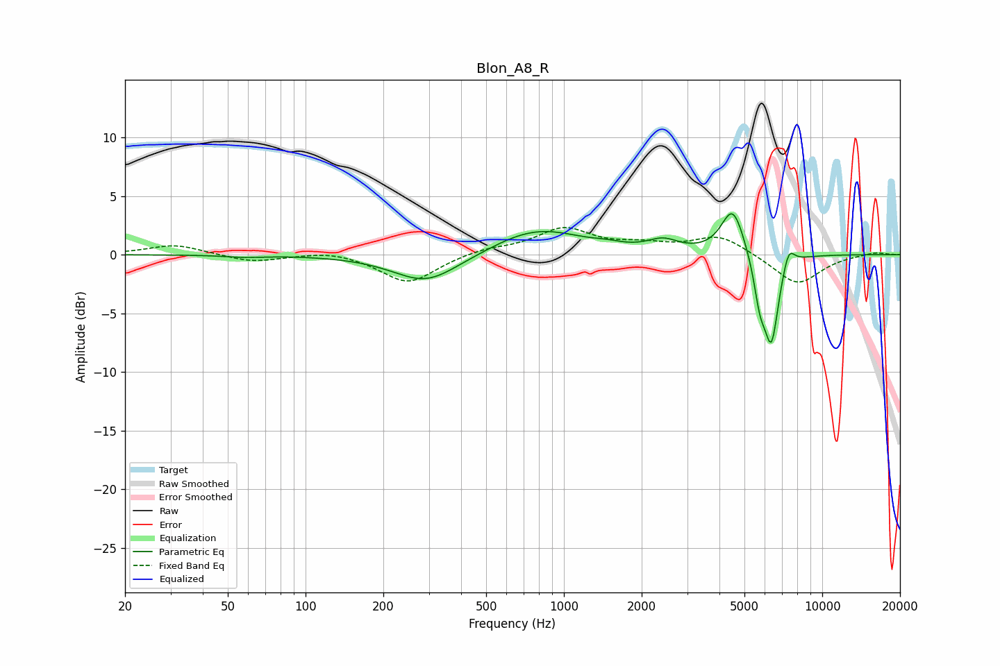

# Blon_A8_R
See [usage instructions](https://github.com/jaakkopasanen/AutoEq#usage) for more options and info.

### Parametric EQs
Apply preamp of -3.6 dB when using parametric equalizer.

|   # | Type    |   Fc (Hz) |    Q |   Gain (dB) |
|-----|---------|-----------|------|-------------|
|   1 | Peaking |        58 | 2.01 |        -0.2 |
|   2 | Peaking |       292 | 1.11 |        -2.4 |
|   3 | Peaking |       648 | 1.15 |         0.4 |
|   4 | Peaking |       833 | 0.86 |         1.9 |
|   5 | Peaking |      1476 | 2.5  |         0.2 |
|   6 | Peaking |      2420 | 2.41 |         0.9 |
|   7 | Peaking |      4506 | 3.15 |         4.1 |
|   8 | Peaking |      5734 | 6    |        -3.2 |
|   9 | Peaking |      6356 | 4.77 |        -7.4 |
|  10 | Peaking |      7414 | 5.98 |         1.7 |

### Fixed Band EQs
When using fixed band (also called graphic) equalizer, apply preamp of **-2.4 dB** (if available) and set gains manually with these parameters.

|   # | Type    |   Fc (Hz) |    Q |   Gain (dB) |
|-----|---------|-----------|------|-------------|
|   1 | Peaking |        31 | 1.41 |         0.9 |
|   2 | Peaking |        62 | 1.41 |        -0.6 |
|   3 | Peaking |       125 | 1.41 |         0.4 |
|   4 | Peaking |       250 | 1.41 |        -2.5 |
|   5 | Peaking |       500 | 1.41 |         0.5 |
|   6 | Peaking |      1000 | 1.41 |         2.1 |
|   7 | Peaking |      2000 | 1.41 |         0.7 |
|   8 | Peaking |      4000 | 1.41 |         1.6 |
|   9 | Peaking |      8000 | 1.41 |        -2.6 |
|  10 | Peaking |     16000 | 1.41 |         0.2 |

### Graphs

