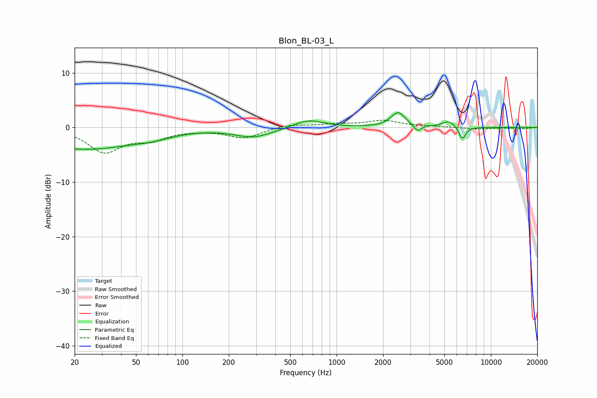

# Blon_BL-03_L
See [usage instructions](https://github.com/jaakkopasanen/AutoEq#usage) for more options and info.

### Parametric EQs
Apply preamp of -2.8 dB when using parametric equalizer.

|   # | Type    |   Fc (Hz) |    Q |   Gain (dB) |
|-----|---------|-----------|------|-------------|
|   1 | Peaking |        20 | 5.76 |        -3.4 |
|   2 | Peaking |        20 | 6    |         3.2 |
|   3 | Peaking |        25 | 0.54 |        -3.7 |
|   4 | Peaking |        63 | 1.02 |        -1   |
|   5 | Peaking |       289 | 1.16 |        -1.8 |
|   6 | Peaking |       659 | 1.46 |         1.5 |
|   7 | Peaking |      2507 | 3.04 |         2.7 |
|   8 | Peaking |      3339 | 6    |        -1.2 |
|   9 | Peaking |      5343 | 3.24 |         1.2 |
|  10 | Peaking |      6528 | 6    |        -2.4 |

### Fixed Band EQs
When using fixed band (also called graphic) equalizer, apply preamp of **-1.4 dB** (if available) and set gains manually with these parameters.

|   # | Type    |   Fc (Hz) |    Q |   Gain (dB) |
|-----|---------|-----------|------|-------------|
|   1 | Peaking |        31 | 1.41 |        -4.3 |
|   2 | Peaking |        62 | 1.41 |        -1.9 |
|   3 | Peaking |       125 | 1.41 |        -0.3 |
|   4 | Peaking |       250 | 1.41 |        -1.9 |
|   5 | Peaking |       500 | 1.41 |         0.6 |
|   6 | Peaking |      1000 | 1.41 |         0.5 |
|   7 | Peaking |      2000 | 1.41 |         1.2 |
|   8 | Peaking |      4000 | 1.41 |         0.2 |
|   9 | Peaking |      8000 | 1.41 |        -0.3 |
|  10 | Peaking |     16000 | 1.41 |        -0.2 |

### Graphs

