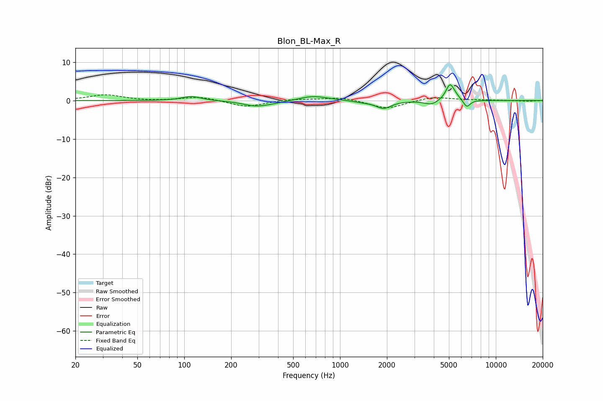

# Blon_BL-Max_R
See [usage instructions](https://github.com/jaakkopasanen/AutoEq#usage) for more options and info.

### Parametric EQs
Apply preamp of -4.2 dB when using parametric equalizer.

|   # | Type    |   Fc (Hz) |    Q |   Gain (dB) |
|-----|---------|-----------|------|-------------|
|   1 | Peaking |       111 | 2.35 |         1.1 |
|   2 | Peaking |       287 | 1.71 |        -1.3 |
|   3 | Peaking |       375 | 1.56 |        -0.4 |
|   4 | Peaking |       671 | 1.52 |         1.3 |
|   5 | Peaking |      1384 | 2.63 |        -0.3 |
|   6 | Peaking |      1900 | 2.83 |        -2   |
|   7 | Peaking |      3863 | 3.21 |        -1.2 |
|   8 | Peaking |      5070 | 5.43 |         3.6 |
|   9 | Peaking |      5331 | 3.45 |         1.1 |
|  10 | Peaking |      6506 | 6    |        -2   |

### Fixed Band EQs
When using fixed band (also called graphic) equalizer, apply preamp of **-1.6 dB** (if available) and set gains manually with these parameters.

|   # | Type    |   Fc (Hz) |    Q |   Gain (dB) |
|-----|---------|-----------|------|-------------|
|   1 | Peaking |        31 | 1.41 |         1.5 |
|   2 | Peaking |        62 | 1.41 |        -0.2 |
|   3 | Peaking |       125 | 1.41 |         1   |
|   4 | Peaking |       250 | 1.41 |        -1.7 |
|   5 | Peaking |       500 | 1.41 |         0.4 |
|   6 | Peaking |      1000 | 1.41 |         0.9 |
|   7 | Peaking |      2000 | 1.41 |        -2.2 |
|   8 | Peaking |      4000 | 1.41 |         1   |
|   9 | Peaking |      8000 | 1.41 |         0.1 |
|  10 | Peaking |     16000 | 1.41 |        -0.2 |

### Graphs

