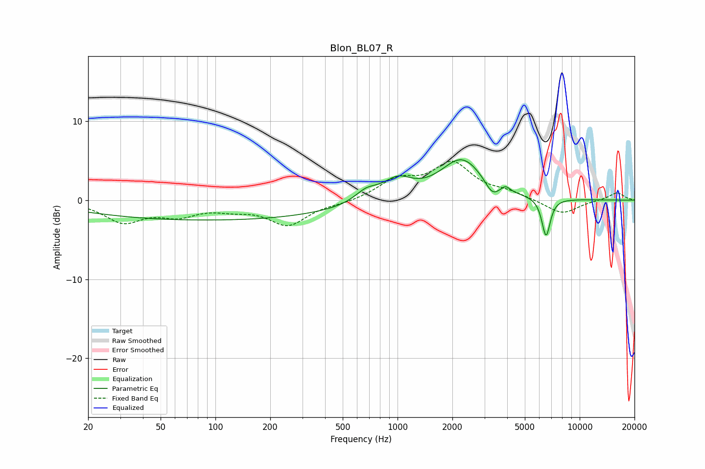

# Blon_BL07_R
See [usage instructions](https://github.com/jaakkopasanen/AutoEq#usage) for more options and info.

### Parametric EQs
Apply preamp of -5.2 dB when using parametric equalizer.

|   # | Type    |   Fc (Hz) |    Q |   Gain (dB) |
|-----|---------|-----------|------|-------------|
|   1 | Peaking |        93 | 0.18 |        -2.5 |
|   2 | Peaking |       673 | 2.3  |         1.4 |
|   3 | Peaking |       933 | 4.81 |        -0.1 |
|   4 | Peaking |       997 | 1.92 |         3.1 |
|   5 | Peaking |      1016 | 2.52 |        -0.6 |
|   6 | Peaking |      2257 | 1.19 |         5.2 |
|   7 | Peaking |      3312 | 3.61 |        -1.7 |
|   8 | Peaking |      3916 | 5.99 |         0.7 |
|   9 | Peaking |      6526 | 5.99 |        -4.5 |
|  10 | Peaking |      6692 | 6    |        -0.4 |

### Fixed Band EQs
When using fixed band (also called graphic) equalizer, apply preamp of **-5.0 dB** (if available) and set gains manually with these parameters.

|   # | Type    |   Fc (Hz) |    Q |   Gain (dB) |
|-----|---------|-----------|------|-------------|
|   1 | Peaking |        31 | 1.41 |        -2.6 |
|   2 | Peaking |        62 | 1.41 |        -1.6 |
|   3 | Peaking |       125 | 1.41 |        -0.8 |
|   4 | Peaking |       250 | 1.41 |        -3   |
|   5 | Peaking |       500 | 1.41 |        -0.3 |
|   6 | Peaking |      1000 | 1.41 |         2.4 |
|   7 | Peaking |      2000 | 1.41 |         4.4 |
|   8 | Peaking |      4000 | 1.41 |         0.8 |
|   9 | Peaking |      8000 | 1.41 |        -1.8 |
|  10 | Peaking |     16000 | 1.41 |         1   |

### Graphs

