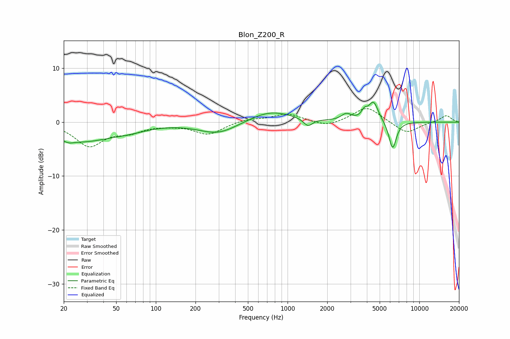

# Blon_Z200_R
See [usage instructions](https://github.com/jaakkopasanen/AutoEq#usage) for more options and info.

### Parametric EQs
Apply preamp of -3.8 dB when using parametric equalizer.

|   # | Type    |   Fc (Hz) |    Q |   Gain (dB) |
|-----|---------|-----------|------|-------------|
|   1 | Peaking |        21 | 3.23 |        -0.7 |
|   2 | Peaking |        28 | 0.65 |        -3.2 |
|   3 | Peaking |        62 | 0.94 |        -0.9 |
|   4 | Peaking |       299 | 0.96 |        -2.2 |
|   5 | Peaking |       740 | 0.85 |         2.2 |
|   6 | Peaking |      1428 | 4.17 |        -1.4 |
|   7 | Peaking |      2794 | 3.83 |         1.2 |
|   8 | Peaking |      3828 | 6    |         1.3 |
|   9 | Peaking |      4491 | 3.77 |         3.6 |
|  10 | Peaking |      6271 | 4.85 |        -5.2 |

### Fixed Band EQs
When using fixed band (also called graphic) equalizer, apply preamp of **-2.6 dB** (if available) and set gains manually with these parameters.

|   # | Type    |   Fc (Hz) |    Q |   Gain (dB) |
|-----|---------|-----------|------|-------------|
|   1 | Peaking |        31 | 1.41 |        -4.3 |
|   2 | Peaking |        62 | 1.41 |        -1.5 |
|   3 | Peaking |       125 | 1.41 |        -0.3 |
|   4 | Peaking |       250 | 1.41 |        -2.2 |
|   5 | Peaking |       500 | 1.41 |         0.6 |
|   6 | Peaking |      1000 | 1.41 |         1.5 |
|   7 | Peaking |      2000 | 1.41 |        -1   |
|   8 | Peaking |      4000 | 1.41 |         2.9 |
|   9 | Peaking |      8000 | 1.41 |        -2.2 |
|  10 | Peaking |     16000 | 1.41 |         1.3 |

### Graphs

