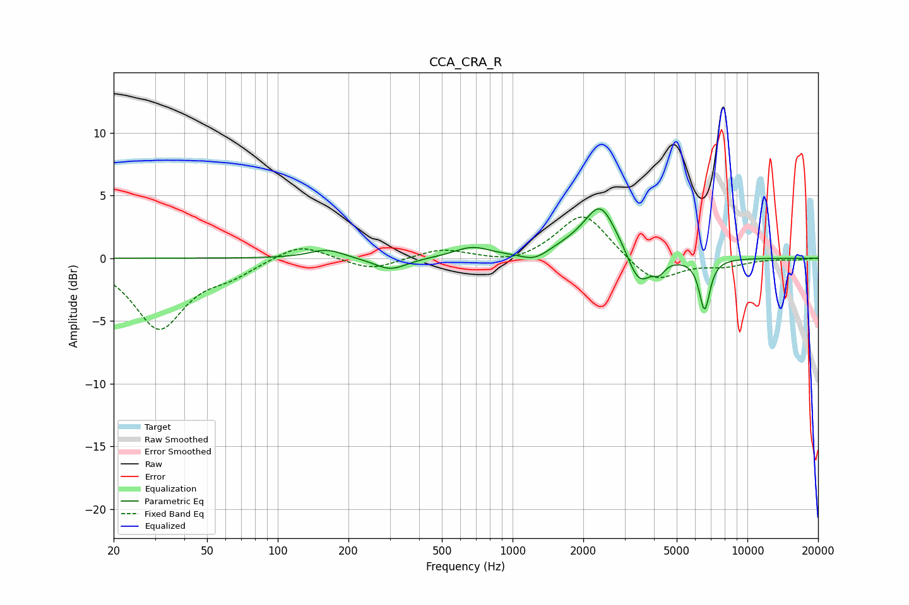

# CCA_CRA_R
See [usage instructions](https://github.com/jaakkopasanen/AutoEq#usage) for more options and info.

### Parametric EQs
Apply preamp of -4.0 dB when using parametric equalizer.

|   # | Type    |   Fc (Hz) |    Q |   Gain (dB) |
|-----|---------|-----------|------|-------------|
|   1 | Peaking |       161 | 1.97 |         0.7 |
|   2 | Peaking |       302 | 2.02 |        -1   |
|   3 | Peaking |       673 | 1.85 |         0.8 |
|   4 | Peaking |      1239 | 2.44 |        -0.7 |
|   5 | Peaking |      1825 | 1.24 |         0.7 |
|   6 | Peaking |      2373 | 2.14 |         3.9 |
|   7 | Peaking |      2995 | 3.24 |         0.4 |
|   8 | Peaking |      3441 | 2.64 |        -2.8 |
|   9 | Peaking |      4217 | 6    |        -0.7 |
|  10 | Peaking |      6571 | 6    |        -4.1 |

### Fixed Band EQs
When using fixed band (also called graphic) equalizer, apply preamp of **-3.4 dB** (if available) and set gains manually with these parameters.

|   # | Type    |   Fc (Hz) |    Q |   Gain (dB) |
|-----|---------|-----------|------|-------------|
|   1 | Peaking |        31 | 1.41 |        -5.5 |
|   2 | Peaking |        62 | 1.41 |        -1   |
|   3 | Peaking |       125 | 1.41 |         1.3 |
|   4 | Peaking |       250 | 1.41 |        -1   |
|   5 | Peaking |       500 | 1.41 |         0.8 |
|   6 | Peaking |      1000 | 1.41 |        -0.5 |
|   7 | Peaking |      2000 | 1.41 |         3.7 |
|   8 | Peaking |      4000 | 1.41 |        -2.1 |
|   9 | Peaking |      8000 | 1.41 |        -0.5 |
|  10 | Peaking |     16000 | 1.41 |        -0.1 |

### Graphs

