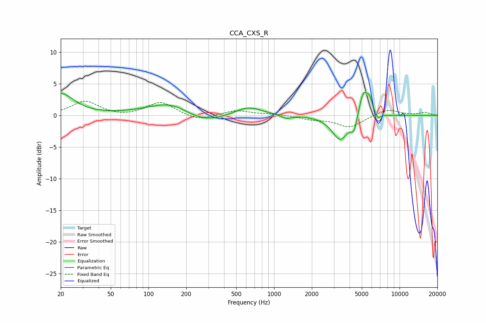

# CCA_CXS_R
See [usage instructions](https://github.com/jaakkopasanen/AutoEq#usage) for more options and info.

### Parametric EQs
Apply preamp of -3.7 dB when using parametric equalizer.

|   # | Type    |   Fc (Hz) |    Q |   Gain (dB) |
|-----|---------|-----------|------|-------------|
|   1 | Peaking |        20 | 1.36 |         3.4 |
|   2 | Peaking |       164 | 0.73 |         3.3 |
|   3 | Peaking |       242 | 0.75 |        -2.7 |
|   4 | Peaking |       620 | 1.28 |         1.5 |
|   5 | Peaking |      1254 | 3.64 |        -0.6 |
|   6 | Peaking |      3373 | 2.12 |        -3.9 |
|   7 | Peaking |      4339 | 5.8  |        -2.1 |
|   8 | Peaking |      5155 | 3.79 |         4.2 |
|   9 | Peaking |      5782 | 5.99 |         1.8 |
|  10 | Peaking |      6715 | 6    |        -1   |

### Fixed Band EQs
When using fixed band (also called graphic) equalizer, apply preamp of **-2.3 dB** (if available) and set gains manually with these parameters.

|   # | Type    |   Fc (Hz) |    Q |   Gain (dB) |
|-----|---------|-----------|------|-------------|
|   1 | Peaking |        31 | 1.41 |         2.2 |
|   2 | Peaking |        62 | 1.41 |        -0.3 |
|   3 | Peaking |       125 | 1.41 |         2.1 |
|   4 | Peaking |       250 | 1.41 |        -0.9 |
|   5 | Peaking |       500 | 1.41 |         0.8 |
|   6 | Peaking |      1000 | 1.41 |         0.2 |
|   7 | Peaking |      2000 | 1.41 |        -0.6 |
|   8 | Peaking |      4000 | 1.41 |        -1.9 |
|   9 | Peaking |      8000 | 1.41 |         1   |
|  10 | Peaking |     16000 | 1.41 |         0.4 |

### Graphs

