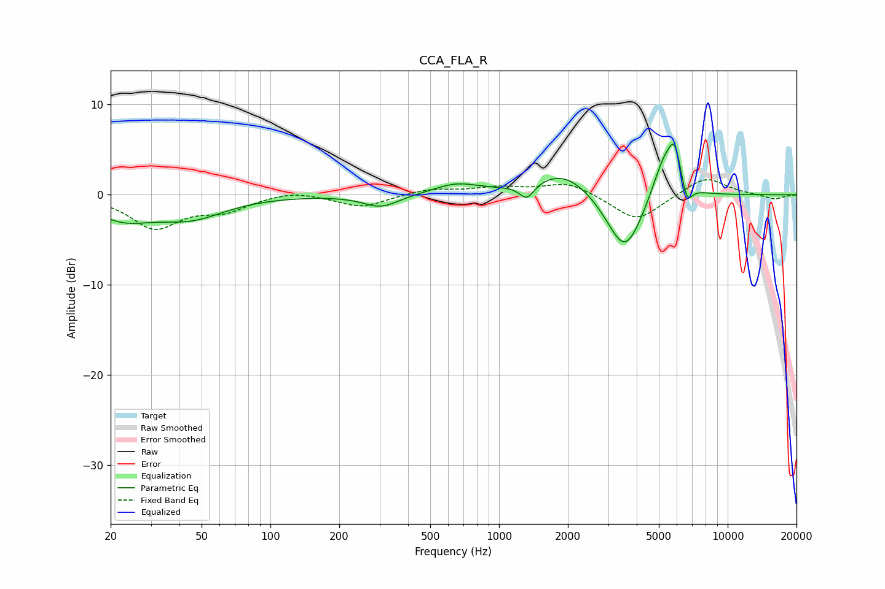

# CCA_FLA_R
See [usage instructions](https://github.com/jaakkopasanen/AutoEq#usage) for more options and info.

### Parametric EQs
Apply preamp of -5.7 dB when using parametric equalizer.

|   # | Type    |   Fc (Hz) |    Q |   Gain (dB) |
|-----|---------|-----------|------|-------------|
|   1 | Peaking |        23 | 1.11 |        -2.3 |
|   2 | Peaking |        45 | 0.92 |        -2.3 |
|   3 | Peaking |       305 | 1.8  |        -1.4 |
|   4 | Peaking |       650 | 1.41 |         1.1 |
|   5 | Peaking |      1323 | 4.4  |        -1.7 |
|   6 | Peaking |      1922 | 1.1  |         2.8 |
|   7 | Peaking |      3553 | 1.74 |        -7   |
|   8 | Peaking |      5287 | 2.53 |         4.8 |
|   9 | Peaking |      5872 | 5.13 |         3.8 |
|  10 | Peaking |      6637 | 5.89 |        -2.3 |

### Fixed Band EQs
When using fixed band (also called graphic) equalizer, apply preamp of **-1.8 dB** (if available) and set gains manually with these parameters.

|   # | Type    |   Fc (Hz) |    Q |   Gain (dB) |
|-----|---------|-----------|------|-------------|
|   1 | Peaking |        31 | 1.41 |        -3.6 |
|   2 | Peaking |        62 | 1.41 |        -1.6 |
|   3 | Peaking |       125 | 1.41 |         0.6 |
|   4 | Peaking |       250 | 1.41 |        -1.4 |
|   5 | Peaking |       500 | 1.41 |         0.6 |
|   6 | Peaking |      1000 | 1.41 |         0.7 |
|   7 | Peaking |      2000 | 1.41 |         1.4 |
|   8 | Peaking |      4000 | 1.41 |        -3   |
|   9 | Peaking |      8000 | 1.41 |         2.1 |
|  10 | Peaking |     16000 | 1.41 |        -0.5 |

### Graphs

