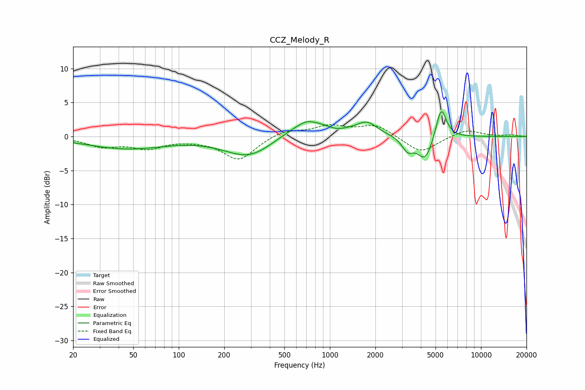

# CCZ_Melody_R
See [usage instructions](https://github.com/jaakkopasanen/AutoEq#usage) for more options and info.

### Parametric EQs
Apply preamp of -3.7 dB when using parametric equalizer.

|   # | Type    |   Fc (Hz) |    Q |   Gain (dB) |
|-----|---------|-----------|------|-------------|
|   1 | Peaking |        41 | 0.56 |        -1.5 |
|   2 | Peaking |        62 | 0.76 |        -0.3 |
|   3 | Peaking |       296 | 0.86 |        -3.3 |
|   4 | Peaking |       698 | 2.4  |         0.7 |
|   5 | Peaking |       724 | 0.7  |         2.4 |
|   6 | Peaking |      1101 | 2.49 |        -0.5 |
|   7 | Peaking |      1761 | 2.19 |         1.7 |
|   8 | Peaking |      3263 | 3.84 |        -1.8 |
|   9 | Peaking |      4273 | 2.61 |        -3.7 |
|  10 | Peaking |      5447 | 3.96 |         4.9 |

### Fixed Band EQs
When using fixed band (also called graphic) equalizer, apply preamp of **-1.8 dB** (if available) and set gains manually with these parameters.

|   # | Type    |   Fc (Hz) |    Q |   Gain (dB) |
|-----|---------|-----------|------|-------------|
|   1 | Peaking |        31 | 1.41 |        -1.4 |
|   2 | Peaking |        62 | 1.41 |        -1.6 |
|   3 | Peaking |       125 | 1.41 |        -0.3 |
|   4 | Peaking |       250 | 1.41 |        -3.4 |
|   5 | Peaking |       500 | 1.41 |         1   |
|   6 | Peaking |      1000 | 1.41 |         1.4 |
|   7 | Peaking |      2000 | 1.41 |         1.7 |
|   8 | Peaking |      4000 | 1.41 |        -2.5 |
|   9 | Peaking |      8000 | 1.41 |         1.1 |
|  10 | Peaking |     16000 | 1.41 |         0.2 |

### Graphs

