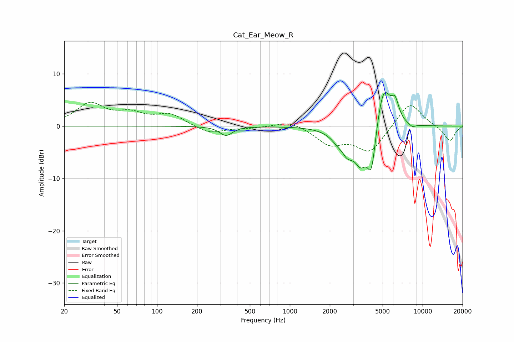

# Cat_Ear_Meow_R
See [usage instructions](https://github.com/jaakkopasanen/AutoEq#usage) for more options and info.

### Parametric EQs
Apply preamp of -6.5 dB when using parametric equalizer.

|   # | Type    |   Fc (Hz) |    Q |   Gain (dB) |
|-----|---------|-----------|------|-------------|
|   1 | Peaking |       331 | 3.02 |        -1.8 |
|   2 | Peaking |      2487 | 4.74 |         1.6 |
|   3 | Peaking |      2535 | 2.62 |        -3.5 |
|   4 | Peaking |      2739 | 2.03 |        -2.7 |
|   5 | Peaking |      3423 | 3.3  |        -4.6 |
|   6 | Peaking |      4115 | 4.19 |        -8.5 |
|   7 | Peaking |      4930 | 2.95 |         5.4 |
|   8 | Peaking |      5260 | 3.31 |         3.2 |
|   9 | Peaking |      6202 | 4.48 |         3.9 |
|  10 | Peaking |      8362 | 5.33 |        -0.6 |

### Fixed Band EQs
When using fixed band (also called graphic) equalizer, apply preamp of **-4.7 dB** (if available) and set gains manually with these parameters.

|   # | Type    |   Fc (Hz) |    Q |   Gain (dB) |
|-----|---------|-----------|------|-------------|
|   1 | Peaking |        31 | 1.41 |         4.1 |
|   2 | Peaking |        62 | 1.41 |         2   |
|   3 | Peaking |       125 | 1.41 |         2.1 |
|   4 | Peaking |       250 | 1.41 |        -1.5 |
|   5 | Peaking |       500 | 1.41 |        -0.3 |
|   6 | Peaking |      1000 | 1.41 |         1.1 |
|   7 | Peaking |      2000 | 1.41 |        -3.2 |
|   8 | Peaking |      4000 | 1.41 |        -4.9 |
|   9 | Peaking |      8000 | 1.41 |         4.8 |
|  10 | Peaking |     16000 | 1.41 |        -2.9 |

### Graphs

