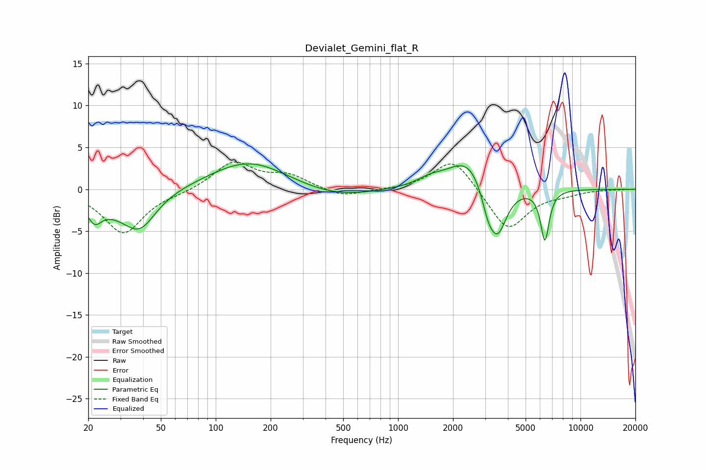

# Devialet_Gemini_flat_R
See [usage instructions](https://github.com/jaakkopasanen/AutoEq#usage) for more options and info.

### Parametric EQs
Apply preamp of -3.1 dB when using parametric equalizer.

|   # | Type    |   Fc (Hz) |    Q |   Gain (dB) |
|-----|---------|-----------|------|-------------|
|   1 | Peaking |        22 | 3.56 |        -2.3 |
|   2 | Peaking |        28 | 1.04 |        -1.5 |
|   3 | Peaking |        38 | 1.58 |        -4   |
|   4 | Peaking |       152 | 0.68 |         3.5 |
|   5 | Peaking |       450 | 0.7  |        -1.2 |
|   6 | Peaking |      1493 | 2.01 |         0.8 |
|   7 | Peaking |      2435 | 1.26 |         4   |
|   8 | Peaking |      3107 | 3.95 |        -2.5 |
|   9 | Peaking |      3510 | 2.68 |        -6.1 |
|  10 | Peaking |      6380 | 5.85 |        -6   |

### Fixed Band EQs
When using fixed band (also called graphic) equalizer, apply preamp of **-3.4 dB** (if available) and set gains manually with these parameters.

|   # | Type    |   Fc (Hz) |    Q |   Gain (dB) |
|-----|---------|-----------|------|-------------|
|   1 | Peaking |        31 | 1.41 |        -5.3 |
|   2 | Peaking |        62 | 1.41 |        -0.3 |
|   3 | Peaking |       125 | 1.41 |         3.2 |
|   4 | Peaking |       250 | 1.41 |         1.5 |
|   5 | Peaking |       500 | 1.41 |        -1   |
|   6 | Peaking |      1000 | 1.41 |        -0.1 |
|   7 | Peaking |      2000 | 1.41 |         3.9 |
|   8 | Peaking |      4000 | 1.41 |        -5   |
|   9 | Peaking |      8000 | 1.41 |        -0.5 |
|  10 | Peaking |     16000 | 1.41 |        -0   |

### Graphs

