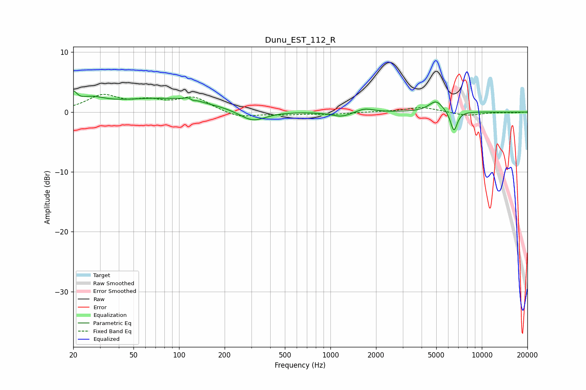

# Dunu_EST_112_R
See [usage instructions](https://github.com/jaakkopasanen/AutoEq#usage) for more options and info.

### Parametric EQs
Apply preamp of -3.6 dB when using parametric equalizer.

|   # | Type    |   Fc (Hz) |    Q |   Gain (dB) |
|-----|---------|-----------|------|-------------|
|   1 | Peaking |        20 | 5.97 |         2   |
|   2 | Peaking |        26 | 1.64 |         1.5 |
|   3 | Peaking |        77 | 0.42 |         2.2 |
|   4 | Peaking |       121 | 4.97 |         2.2 |
|   5 | Peaking |       122 | 6    |        -2   |
|   6 | Peaking |       306 | 1.59 |        -1.9 |
|   7 | Peaking |      1185 | 2.13 |        -0.8 |
|   8 | Peaking |      1682 | 2.51 |         0.7 |
|   9 | Peaking |      4986 | 2.92 |         1.9 |
|  10 | Peaking |      6537 | 6    |        -3.4 |

### Fixed Band EQs
When using fixed band (also called graphic) equalizer, apply preamp of **-3.0 dB** (if available) and set gains manually with these parameters.

|   # | Type    |   Fc (Hz) |    Q |   Gain (dB) |
|-----|---------|-----------|------|-------------|
|   1 | Peaking |        31 | 1.41 |         2.6 |
|   2 | Peaking |        62 | 1.41 |         1.5 |
|   3 | Peaking |       125 | 1.41 |         2.3 |
|   4 | Peaking |       250 | 1.41 |        -1   |
|   5 | Peaking |       500 | 1.41 |        -0.4 |
|   6 | Peaking |      1000 | 1.41 |        -0.3 |
|   7 | Peaking |      2000 | 1.41 |         0   |
|   8 | Peaking |      4000 | 1.41 |         0.8 |
|   9 | Peaking |      8000 | 1.41 |        -0.6 |
|  10 | Peaking |     16000 | 1.41 |        -0.1 |

### Graphs

