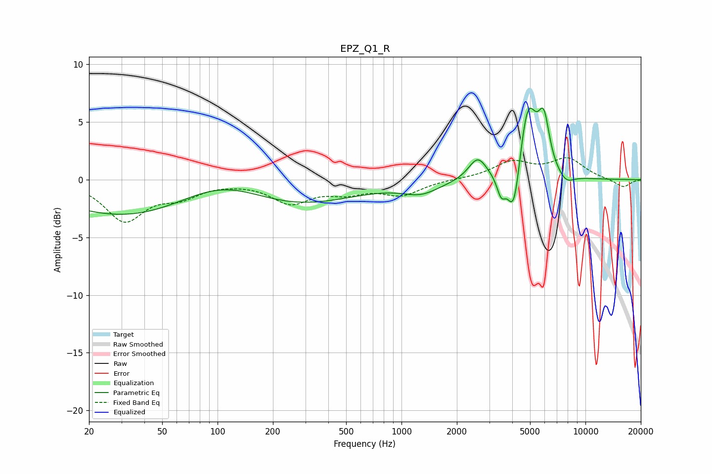

# EPZ_Q1_R
See [usage instructions](https://github.com/jaakkopasanen/AutoEq#usage) for more options and info.

### Parametric EQs
Apply preamp of -6.3 dB when using parametric equalizer.

|   # | Type    |   Fc (Hz) |    Q |   Gain (dB) |
|-----|---------|-----------|------|-------------|
|   1 | Peaking |        79 | 0.18 |        -4.6 |
|   2 | Peaking |       105 | 0.54 |         3.7 |
|   3 | Peaking |      1276 | 1.41 |        -1   |
|   4 | Peaking |      2596 | 2.86 |         1.9 |
|   5 | Peaking |      3483 | 5.97 |        -1.7 |
|   6 | Peaking |      4090 | 3.99 |        -4.9 |
|   7 | Peaking |      4853 | 2.82 |         6.8 |
|   8 | Peaking |      5946 | 4.43 |         4.2 |
|   9 | Peaking |      6482 | 1.79 |        -0.2 |
|  10 | Peaking |      7844 | 3.11 |        -0.8 |

### Fixed Band EQs
When using fixed band (also called graphic) equalizer, apply preamp of **-2.0 dB** (if available) and set gains manually with these parameters.

|   # | Type    |   Fc (Hz) |    Q |   Gain (dB) |
|-----|---------|-----------|------|-------------|
|   1 | Peaking |        31 | 1.41 |        -3.4 |
|   2 | Peaking |        62 | 1.41 |        -1.2 |
|   3 | Peaking |       125 | 1.41 |        -0.1 |
|   4 | Peaking |       250 | 1.41 |        -1.9 |
|   5 | Peaking |       500 | 1.41 |        -0.9 |
|   6 | Peaking |      1000 | 1.41 |        -1.2 |
|   7 | Peaking |      2000 | 1.41 |         0   |
|   8 | Peaking |      4000 | 1.41 |         1.5 |
|   9 | Peaking |      8000 | 1.41 |         1.7 |
|  10 | Peaking |     16000 | 1.41 |        -0.7 |

### Graphs

