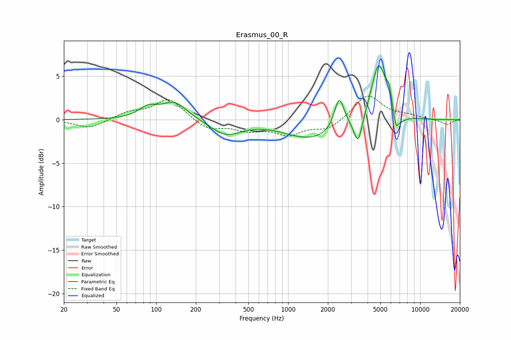

# Erasmus_00_R
See [usage instructions](https://github.com/jaakkopasanen/AutoEq#usage) for more options and info.

### Parametric EQs
Apply preamp of -6.3 dB when using parametric equalizer.

|   # | Type    |   Fc (Hz) |    Q |   Gain (dB) |
|-----|---------|-----------|------|-------------|
|   1 | Peaking |        87 | 2.03 |         1.1 |
|   2 | Peaking |       138 | 1.48 |         2   |
|   3 | Peaking |       337 | 1.26 |        -1.7 |
|   4 | Peaking |      1533 | 0.68 |        -2.2 |
|   5 | Peaking |      2437 | 3.93 |         3.6 |
|   6 | Peaking |      3390 | 4.48 |        -3.2 |
|   7 | Peaking |      4844 | 2.5  |         6.7 |
|   8 | Peaking |      5842 | 5.98 |         1.9 |
|   9 | Peaking |      6538 | 6    |        -2.2 |
|  10 | Peaking |      7247 | 3.47 |        -0.6 |

### Fixed Band EQs
When using fixed band (also called graphic) equalizer, apply preamp of **-2.8 dB** (if available) and set gains manually with these parameters.

|   # | Type    |   Fc (Hz) |    Q |   Gain (dB) |
|-----|---------|-----------|------|-------------|
|   1 | Peaking |        31 | 1.41 |        -1   |
|   2 | Peaking |        62 | 1.41 |         0.8 |
|   3 | Peaking |       125 | 1.41 |         2.4 |
|   4 | Peaking |       250 | 1.41 |        -1.2 |
|   5 | Peaking |       500 | 1.41 |        -1   |
|   6 | Peaking |      1000 | 1.41 |        -1.5 |
|   7 | Peaking |      2000 | 1.41 |        -1.1 |
|   8 | Peaking |      4000 | 1.41 |         2.9 |
|   9 | Peaking |      8000 | 1.41 |         0.4 |
|  10 | Peaking |     16000 | 1.41 |        -0.6 |

### Graphs

