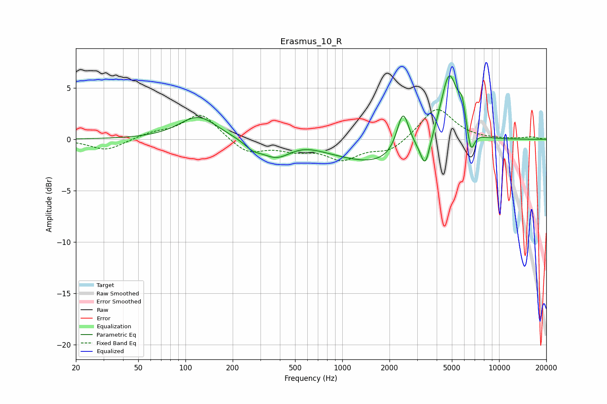

# Erasmus_10_R
See [usage instructions](https://github.com/jaakkopasanen/AutoEq#usage) for more options and info.

### Parametric EQs
Apply preamp of -6.3 dB when using parametric equalizer.

|   # | Type    |   Fc (Hz) |    Q |   Gain (dB) |
|-----|---------|-----------|------|-------------|
|   1 | Peaking |       121 | 1.16 |         2.3 |
|   2 | Peaking |       268 | 2.77 |        -0.6 |
|   3 | Peaking |       377 | 1.46 |        -1.6 |
|   4 | Peaking |       562 | 1.41 |         0.4 |
|   5 | Peaking |      1698 | 0.51 |        -2.4 |
|   6 | Peaking |      2439 | 3.64 |         4.1 |
|   7 | Peaking |      3381 | 4.74 |        -2.8 |
|   8 | Peaking |      4802 | 2.5  |         6.9 |
|   9 | Peaking |      5819 | 5.94 |         2.1 |
|  10 | Peaking |      6603 | 5.88 |        -2.5 |

### Fixed Band EQs
When using fixed band (also called graphic) equalizer, apply preamp of **-3.0 dB** (if available) and set gains manually with these parameters.

|   # | Type    |   Fc (Hz) |    Q |   Gain (dB) |
|-----|---------|-----------|------|-------------|
|   1 | Peaking |        31 | 1.41 |        -1.1 |
|   2 | Peaking |        62 | 1.41 |         0.5 |
|   3 | Peaking |       125 | 1.41 |         2.6 |
|   4 | Peaking |       250 | 1.41 |        -1.4 |
|   5 | Peaking |       500 | 1.41 |        -0.9 |
|   6 | Peaking |      1000 | 1.41 |        -1.8 |
|   7 | Peaking |      2000 | 1.41 |        -1.2 |
|   8 | Peaking |      4000 | 1.41 |         3.1 |
|   9 | Peaking |      8000 | 1.41 |        -0   |
|  10 | Peaking |     16000 | 1.41 |         0.2 |

### Graphs

