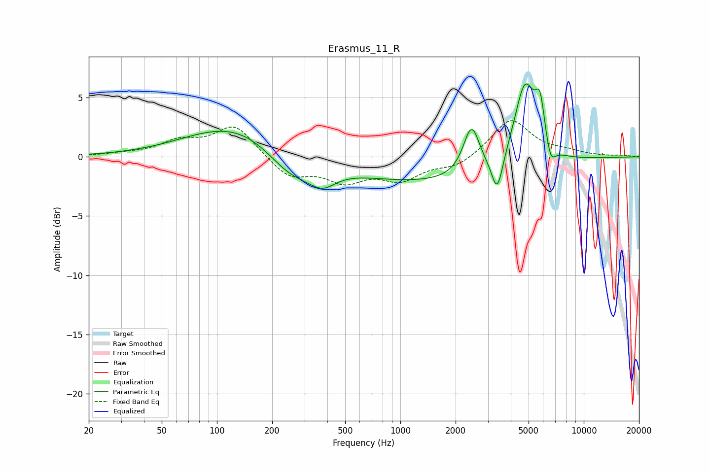

# Erasmus_11_R
See [usage instructions](https://github.com/jaakkopasanen/AutoEq#usage) for more options and info.

### Parametric EQs
Apply preamp of -6.2 dB when using parametric equalizer.

|   # | Type    |   Fc (Hz) |    Q |   Gain (dB) |
|-----|---------|-----------|------|-------------|
|   1 | Peaking |        91 | 0.75 |         0.2 |
|   2 | Peaking |       154 | 0.48 |         3.2 |
|   3 | Peaking |       250 | 0.95 |        -3   |
|   4 | Peaking |       376 | 1.9  |        -1.4 |
|   5 | Peaking |      1510 | 0.27 |        -2.2 |
|   6 | Peaking |      2443 | 3.18 |         4.1 |
|   7 | Peaking |      3374 | 4.66 |        -3.1 |
|   8 | Peaking |      4775 | 2.35 |         7   |
|   9 | Peaking |      5777 | 5.3  |         3.5 |
|  10 | Peaking |      6587 | 5.22 |        -1.7 |

### Fixed Band EQs
When using fixed band (also called graphic) equalizer, apply preamp of **-3.1 dB** (if available) and set gains manually with these parameters.

|   # | Type    |   Fc (Hz) |    Q |   Gain (dB) |
|-----|---------|-----------|------|-------------|
|   1 | Peaking |        31 | 1.41 |         0.2 |
|   2 | Peaking |        62 | 1.41 |         1.2 |
|   3 | Peaking |       125 | 1.41 |         2.7 |
|   4 | Peaking |       250 | 1.41 |        -1.7 |
|   5 | Peaking |       500 | 1.41 |        -1.8 |
|   6 | Peaking |      1000 | 1.41 |        -1.8 |
|   7 | Peaking |      2000 | 1.41 |        -0.9 |
|   8 | Peaking |      4000 | 1.41 |         3.2 |
|   9 | Peaking |      8000 | 1.41 |         0.4 |
|  10 | Peaking |     16000 | 1.41 |         0.1 |

### Graphs

