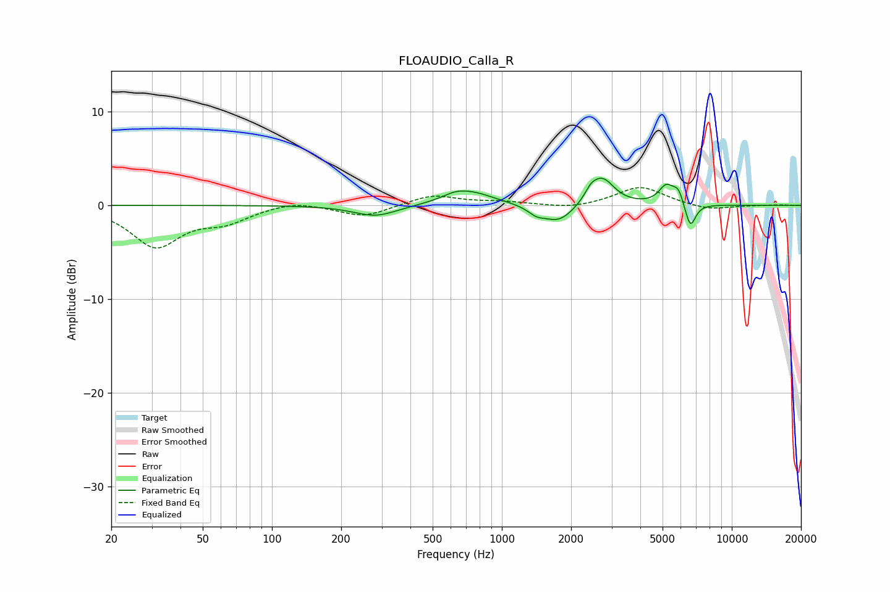

# FLOAUDIO_Calla_R
See [usage instructions](https://github.com/jaakkopasanen/AutoEq#usage) for more options and info.

### Parametric EQs
Apply preamp of -3.0 dB when using parametric equalizer.

|   # | Type    |   Fc (Hz) |    Q |   Gain (dB) |
|-----|---------|-----------|------|-------------|
|   1 | Peaking |       283 | 1.48 |        -1.2 |
|   2 | Peaking |       621 | 2.97 |         0.3 |
|   3 | Peaking |       720 | 1.35 |         1.5 |
|   4 | Peaking |      1412 | 3.9  |        -0.7 |
|   5 | Peaking |      1765 | 2.08 |        -1.9 |
|   6 | Peaking |      2439 | 5.42 |         0.8 |
|   7 | Peaking |      2735 | 2.72 |         2.9 |
|   8 | Peaking |      5190 | 4.29 |         1.9 |
|   9 | Peaking |      5853 | 6    |         1.5 |
|  10 | Peaking |      6602 | 5.99 |        -2.7 |

### Fixed Band EQs
When using fixed band (also called graphic) equalizer, apply preamp of **-2.0 dB** (if available) and set gains manually with these parameters.

|   # | Type    |   Fc (Hz) |    Q |   Gain (dB) |
|-----|---------|-----------|------|-------------|
|   1 | Peaking |        31 | 1.41 |        -4.3 |
|   2 | Peaking |        62 | 1.41 |        -1.5 |
|   3 | Peaking |       125 | 1.41 |         0.6 |
|   4 | Peaking |       250 | 1.41 |        -1.2 |
|   5 | Peaking |       500 | 1.41 |         1.1 |
|   6 | Peaking |      1000 | 1.41 |         0.3 |
|   7 | Peaking |      2000 | 1.41 |        -0.4 |
|   8 | Peaking |      4000 | 1.41 |         2   |
|   9 | Peaking |      8000 | 1.41 |        -0.5 |
|  10 | Peaking |     16000 | 1.41 |         0.1 |

### Graphs

