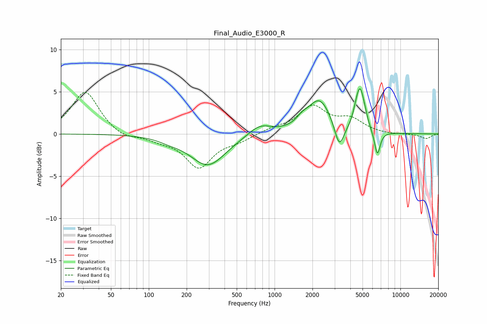

# Final_Audio_E3000_R
See [usage instructions](https://github.com/jaakkopasanen/AutoEq#usage) for more options and info.

### Parametric EQs
Apply preamp of -5.4 dB when using parametric equalizer.

|   # | Type    |   Fc (Hz) |    Q |   Gain (dB) |
|-----|---------|-----------|------|-------------|
|   1 | Peaking |       146 | 1.68 |        -0.3 |
|   2 | Peaking |       295 | 1    |        -3.7 |
|   3 | Peaking |       761 | 1.54 |         1.3 |
|   4 | Peaking |      1647 | 3.43 |         0.6 |
|   5 | Peaking |      2270 | 1.5  |         4   |
|   6 | Peaking |      3267 | 3.75 |        -3.1 |
|   7 | Peaking |      4451 | 5.5  |         1.1 |
|   8 | Peaking |      4786 | 4.57 |         4.2 |
|   9 | Peaking |      5198 | 5.66 |         0.8 |
|  10 | Peaking |      6553 | 6    |        -2.9 |

### Fixed Band EQs
When using fixed band (also called graphic) equalizer, apply preamp of **-5.0 dB** (if available) and set gains manually with these parameters.

|   # | Type    |   Fc (Hz) |    Q |   Gain (dB) |
|-----|---------|-----------|------|-------------|
|   1 | Peaking |        31 | 1.41 |         5.1 |
|   2 | Peaking |        62 | 1.41 |        -0.7 |
|   3 | Peaking |       125 | 1.41 |        -0.6 |
|   4 | Peaking |       250 | 1.41 |        -3.9 |
|   5 | Peaking |       500 | 1.41 |        -0.7 |
|   6 | Peaking |      1000 | 1.41 |         0.6 |
|   7 | Peaking |      2000 | 1.41 |         3.1 |
|   8 | Peaking |      4000 | 1.41 |         1.6 |
|   9 | Peaking |      8000 | 1.41 |        -0.1 |
|  10 | Peaking |     16000 | 1.41 |        -0.6 |

### Graphs

