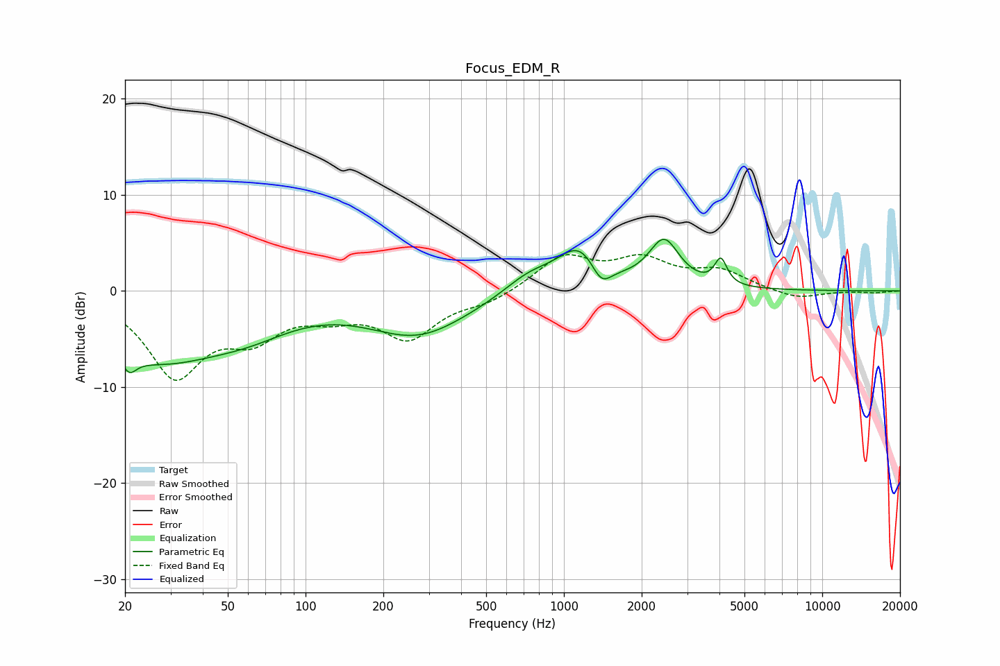

# Focus_EDM_R
See [usage instructions](https://github.com/jaakkopasanen/AutoEq#usage) for more options and info.

### Parametric EQs
Apply preamp of -5.5 dB when using parametric equalizer.

|   # | Type    |   Fc (Hz) |    Q |   Gain (dB) |
|-----|---------|-----------|------|-------------|
|   1 | Peaking |        21 | 5.56 |         3.3 |
|   2 | Peaking |        21 | 5.38 |        -5   |
|   3 | Peaking |        26 | 0.51 |        -6.9 |
|   4 | Peaking |        61 | 0.84 |        -1.8 |
|   5 | Peaking |       273 | 0.72 |        -4.4 |
|   6 | Peaking |       730 | 1.45 |         1.8 |
|   7 | Peaking |      1157 | 1.6  |         4.5 |
|   8 | Peaking |      1393 | 3.49 |        -2.5 |
|   9 | Peaking |      2442 | 2.39 |         4.9 |
|  10 | Peaking |      4049 | 6    |         2.7 |

### Fixed Band EQs
When using fixed band (also called graphic) equalizer, apply preamp of **-3.9 dB** (if available) and set gains manually with these parameters.

|   # | Type    |   Fc (Hz) |    Q |   Gain (dB) |
|-----|---------|-----------|------|-------------|
|   1 | Peaking |        31 | 1.41 |        -8.5 |
|   2 | Peaking |        62 | 1.41 |        -3.9 |
|   3 | Peaking |       125 | 1.41 |        -1.8 |
|   4 | Peaking |       250 | 1.41 |        -4.6 |
|   5 | Peaking |       500 | 1.41 |        -1.1 |
|   6 | Peaking |      1000 | 1.41 |         3.5 |
|   7 | Peaking |      2000 | 1.41 |         2.9 |
|   8 | Peaking |      4000 | 1.41 |         1.9 |
|   9 | Peaking |      8000 | 1.41 |        -0.9 |
|  10 | Peaking |     16000 | 1.41 |        -0.2 |

### Graphs

