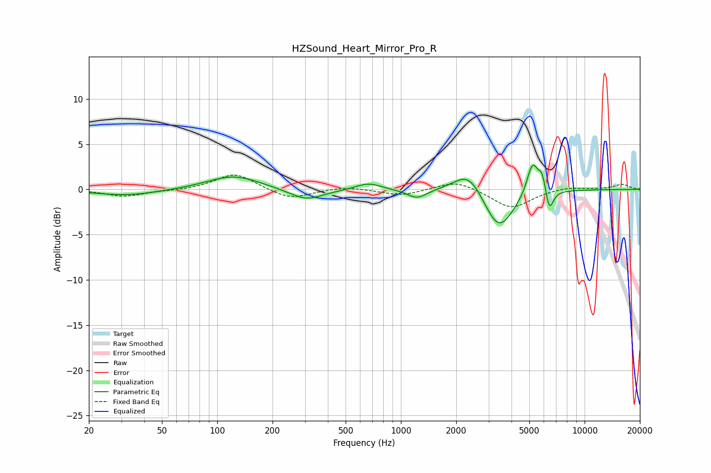

# HZSound_Heart_Mirror_Pro_R
See [usage instructions](https://github.com/jaakkopasanen/AutoEq#usage) for more options and info.

### Parametric EQs
Apply preamp of -2.8 dB when using parametric equalizer.

|   # | Type    |   Fc (Hz) |    Q |   Gain (dB) |
|-----|---------|-----------|------|-------------|
|   1 | Peaking |        32 | 0.8  |        -0.7 |
|   2 | Peaking |       123 | 0.99 |         1.5 |
|   3 | Peaking |       305 | 1.51 |        -1.3 |
|   4 | Peaking |       666 | 2.09 |         0.8 |
|   5 | Peaking |      1224 | 2.58 |        -1   |
|   6 | Peaking |      2344 | 1.79 |         2.6 |
|   7 | Peaking |      3407 | 1.73 |        -4.7 |
|   8 | Peaking |      5194 | 4.59 |         3.5 |
|   9 | Peaking |      5894 | 5.96 |         2.2 |
|  10 | Peaking |      6407 | 6    |        -2.7 |

### Fixed Band EQs
When using fixed band (also called graphic) equalizer, apply preamp of **-1.7 dB** (if available) and set gains manually with these parameters.

|   # | Type    |   Fc (Hz) |    Q |   Gain (dB) |
|-----|---------|-----------|------|-------------|
|   1 | Peaking |        31 | 1.41 |        -0.8 |
|   2 | Peaking |        62 | 1.41 |        -0.1 |
|   3 | Peaking |       125 | 1.41 |         1.8 |
|   4 | Peaking |       250 | 1.41 |        -1.1 |
|   5 | Peaking |       500 | 1.41 |         0.3 |
|   6 | Peaking |      1000 | 1.41 |        -0.7 |
|   7 | Peaking |      2000 | 1.41 |         1   |
|   8 | Peaking |      4000 | 1.41 |        -2.1 |
|   9 | Peaking |      8000 | 1.41 |         0.3 |
|  10 | Peaking |     16000 | 1.41 |         0.6 |

### Graphs

