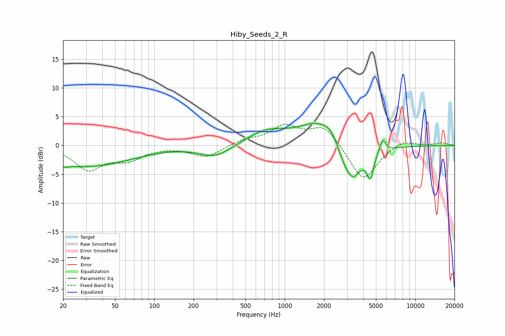

# Hiby_Seeds_2_R
See [usage instructions](https://github.com/jaakkopasanen/AutoEq#usage) for more options and info.

### Parametric EQs
Apply preamp of -3.9 dB when using parametric equalizer.

|   # | Type    |   Fc (Hz) |    Q |   Gain (dB) |
|-----|---------|-----------|------|-------------|
|   1 | Peaking |        20 | 3.92 |        -0.6 |
|   2 | Peaking |        31 | 0.43 |        -3.6 |
|   3 | Peaking |       293 | 1.2  |        -2.1 |
|   4 | Peaking |       718 | 0.94 |         2.3 |
|   5 | Peaking |      1829 | 0.9  |         4.4 |
|   6 | Peaking |      2311 | 2.1  |         2.6 |
|   7 | Peaking |      3081 | 1.33 |        -7.3 |
|   8 | Peaking |      3341 | 4.01 |        -1   |
|   9 | Peaking |      4532 | 5.91 |        -3.9 |
|  10 | Peaking |      5618 | 6    |         2.3 |

### Fixed Band EQs
When using fixed band (also called graphic) equalizer, apply preamp of **-3.8 dB** (if available) and set gains manually with these parameters.

|   # | Type    |   Fc (Hz) |    Q |   Gain (dB) |
|-----|---------|-----------|------|-------------|
|   1 | Peaking |        31 | 1.41 |        -4   |
|   2 | Peaking |        62 | 1.41 |        -2.2 |
|   3 | Peaking |       125 | 1.41 |        -0.2 |
|   4 | Peaking |       250 | 1.41 |        -2   |
|   5 | Peaking |       500 | 1.41 |         0.9 |
|   6 | Peaking |      1000 | 1.41 |         3.2 |
|   7 | Peaking |      2000 | 1.41 |         3.4 |
|   8 | Peaking |      4000 | 1.41 |        -6.3 |
|   9 | Peaking |      8000 | 1.41 |         1.1 |
|  10 | Peaking |     16000 | 1.41 |         0.5 |

### Graphs

