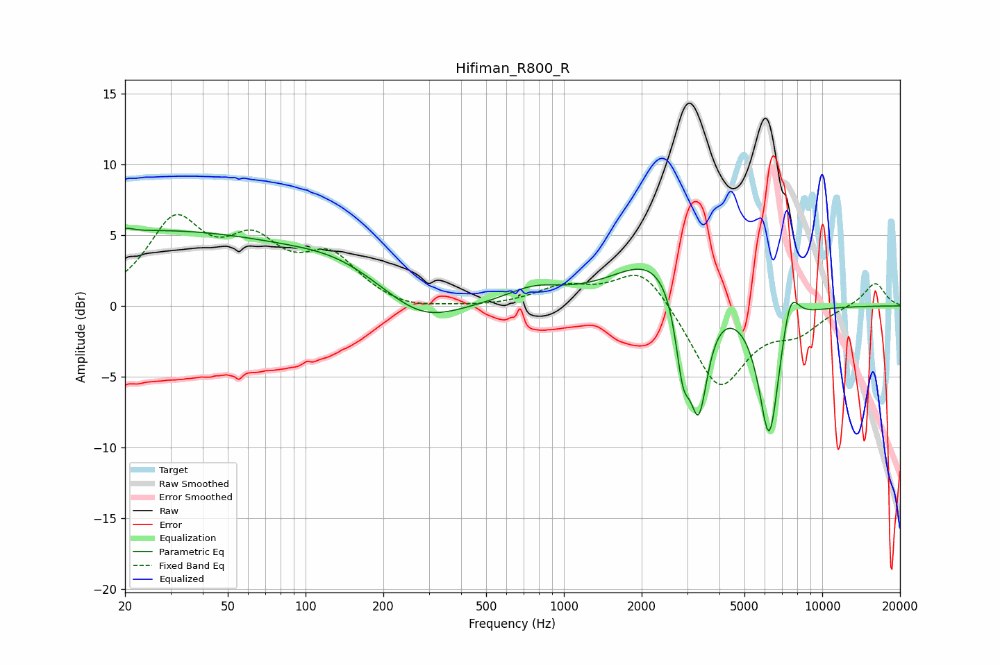

# Hifiman_R800_R
See [usage instructions](https://github.com/jaakkopasanen/AutoEq#usage) for more options and info.

### Parametric EQs
Apply preamp of -5.6 dB when using parametric equalizer.

|   # | Type    |   Fc (Hz) |    Q |   Gain (dB) |
|-----|---------|-----------|------|-------------|
|   1 | Peaking |        20 | 5.79 |         0.2 |
|   2 | Peaking |        25 | 0.21 |         5.2 |
|   3 | Peaking |       136 | 0.78 |         1.4 |
|   4 | Peaking |       283 | 0.98 |        -1.9 |
|   5 | Peaking |       767 | 1.31 |         1   |
|   6 | Peaking |      2311 | 0.88 |         3.7 |
|   7 | Peaking |      2886 | 5.04 |        -4.9 |
|   8 | Peaking |      3324 | 3.81 |        -8.2 |
|   9 | Peaking |      6236 | 3.29 |        -9.9 |
|  10 | Peaking |      7505 | 3.96 |         3   |

### Fixed Band EQs
When using fixed band (also called graphic) equalizer, apply preamp of **-6.6 dB** (if available) and set gains manually with these parameters.

|   # | Type    |   Fc (Hz) |    Q |   Gain (dB) |
|-----|---------|-----------|------|-------------|
|   1 | Peaking |        31 | 1.41 |         5.6 |
|   2 | Peaking |        62 | 1.41 |         3.7 |
|   3 | Peaking |       125 | 1.41 |         3.1 |
|   4 | Peaking |       250 | 1.41 |        -0.5 |
|   5 | Peaking |       500 | 1.41 |        -0.1 |
|   6 | Peaking |      1000 | 1.41 |         1.2 |
|   7 | Peaking |      2000 | 1.41 |         2.9 |
|   8 | Peaking |      4000 | 1.41 |        -5.9 |
|   9 | Peaking |      8000 | 1.41 |        -1.6 |
|  10 | Peaking |     16000 | 1.41 |         1.7 |

### Graphs

