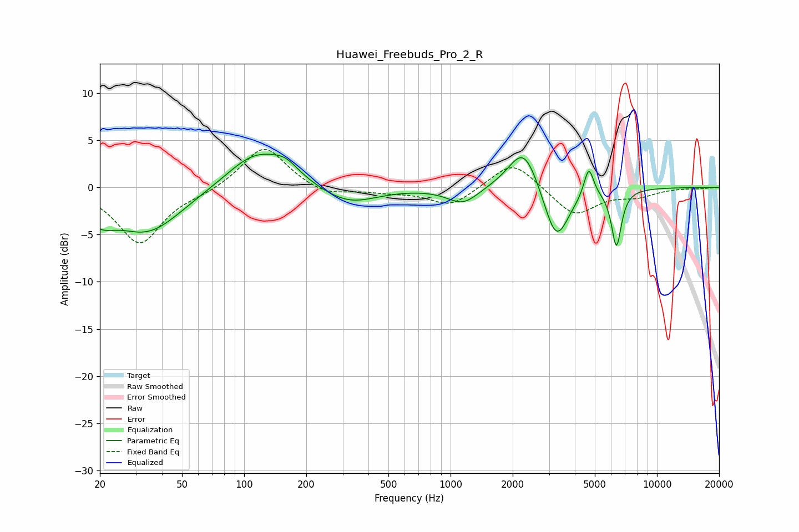

# Huawei_Freebuds_Pro_2_R
See [usage instructions](https://github.com/jaakkopasanen/AutoEq#usage) for more options and info.

### Parametric EQs
Apply preamp of -3.6 dB when using parametric equalizer.

|   # | Type    |   Fc (Hz) |    Q |   Gain (dB) |
|-----|---------|-----------|------|-------------|
|   1 | Peaking |        20 | 2.08 |        -2   |
|   2 | Peaking |        34 | 0.84 |        -4.7 |
|   3 | Peaking |       115 | 0.98 |         3.9 |
|   4 | Peaking |       159 | 2.22 |         1.2 |
|   5 | Peaking |       320 | 1.04 |        -1.9 |
|   6 | Peaking |      1149 | 1.85 |        -1.8 |
|   7 | Peaking |      2268 | 1.89 |         4.9 |
|   8 | Peaking |      3250 | 2.27 |        -6.2 |
|   9 | Peaking |      4675 | 6    |         3.2 |
|  10 | Peaking |      6363 | 5.75 |        -6.1 |

### Fixed Band EQs
When using fixed band (also called graphic) equalizer, apply preamp of **-4.1 dB** (if available) and set gains manually with these parameters.

|   # | Type    |   Fc (Hz) |    Q |   Gain (dB) |
|-----|---------|-----------|------|-------------|
|   1 | Peaking |        31 | 1.41 |        -5.9 |
|   2 | Peaking |        62 | 1.41 |        -0.5 |
|   3 | Peaking |       125 | 1.41 |         4.5 |
|   4 | Peaking |       250 | 1.41 |        -1   |
|   5 | Peaking |       500 | 1.41 |        -0.4 |
|   6 | Peaking |      1000 | 1.41 |        -2   |
|   7 | Peaking |      2000 | 1.41 |         3   |
|   8 | Peaking |      4000 | 1.41 |        -3   |
|   9 | Peaking |      8000 | 1.41 |        -0.8 |
|  10 | Peaking |     16000 | 1.41 |        -0.1 |

### Graphs

