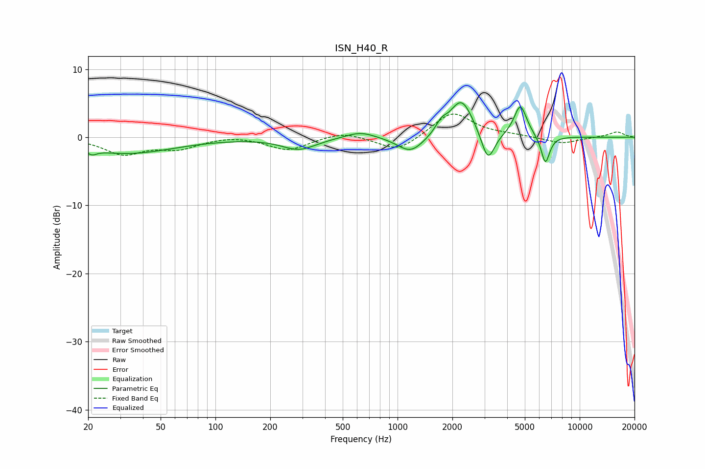

# ISN_H40_R
See [usage instructions](https://github.com/jaakkopasanen/AutoEq#usage) for more options and info.

### Parametric EQs
Apply preamp of -5.2 dB when using parametric equalizer.

|   # | Type    |   Fc (Hz) |    Q |   Gain (dB) |
|-----|---------|-----------|------|-------------|
|   1 | Peaking |        21 | 5.56 |        -0.7 |
|   2 | Peaking |        33 | 0.54 |        -2.3 |
|   3 | Peaking |       287 | 1.51 |        -1.7 |
|   4 | Peaking |       624 | 1.74 |         1   |
|   5 | Peaking |      1183 | 1.93 |        -2.5 |
|   6 | Peaking |      1737 | 4.71 |         1.3 |
|   7 | Peaking |      2241 | 2.18 |         5.7 |
|   8 | Peaking |      3136 | 3.85 |        -4.6 |
|   9 | Peaking |      4724 | 3.99 |         4.7 |
|  10 | Peaking |      6486 | 5.8  |        -4.1 |

### Fixed Band EQs
When using fixed band (also called graphic) equalizer, apply preamp of **-3.5 dB** (if available) and set gains manually with these parameters.

|   # | Type    |   Fc (Hz) |    Q |   Gain (dB) |
|-----|---------|-----------|------|-------------|
|   1 | Peaking |        31 | 1.41 |        -2.4 |
|   2 | Peaking |        62 | 1.41 |        -1.5 |
|   3 | Peaking |       125 | 1.41 |         0.3 |
|   4 | Peaking |       250 | 1.41 |        -1.9 |
|   5 | Peaking |       500 | 1.41 |         0.9 |
|   6 | Peaking |      1000 | 1.41 |        -2.2 |
|   7 | Peaking |      2000 | 1.41 |         3.8 |
|   8 | Peaking |      4000 | 1.41 |         0.3 |
|   9 | Peaking |      8000 | 1.41 |        -0.9 |
|  10 | Peaking |     16000 | 1.41 |         0.8 |

### Graphs

