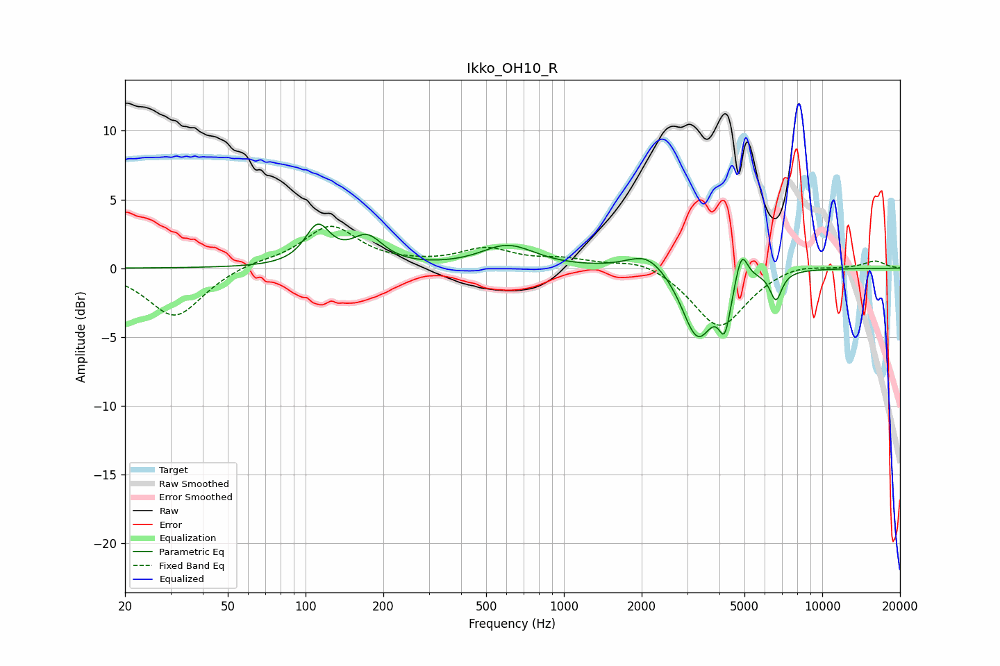

# Ikko_OH10_R
See [usage instructions](https://github.com/jaakkopasanen/AutoEq#usage) for more options and info.

### Parametric EQs
Apply preamp of -3.3 dB when using parametric equalizer.

|   # | Type    |   Fc (Hz) |    Q |   Gain (dB) |
|-----|---------|-----------|------|-------------|
|   1 | Peaking |       111 | 2.95 |         2.8 |
|   2 | Peaking |       173 | 2.27 |         2   |
|   3 | Peaking |       609 | 1.43 |         1.7 |
|   4 | Peaking |       622 | 2.6  |        -0.1 |
|   5 | Peaking |      2100 | 1.89 |         1.4 |
|   6 | Peaking |      3086 | 3.44 |        -0.4 |
|   7 | Peaking |      3319 | 2.34 |        -4.8 |
|   8 | Peaking |      4198 | 6    |        -3.2 |
|   9 | Peaking |      4872 | 5.91 |         2.3 |
|  10 | Peaking |      6619 | 6    |        -2.1 |

### Fixed Band EQs
When using fixed band (also called graphic) equalizer, apply preamp of **-3.1 dB** (if available) and set gains manually with these parameters.

|   # | Type    |   Fc (Hz) |    Q |   Gain (dB) |
|-----|---------|-----------|------|-------------|
|   1 | Peaking |        31 | 1.41 |        -3.6 |
|   2 | Peaking |        62 | 1.41 |         0.4 |
|   3 | Peaking |       125 | 1.41 |         3   |
|   4 | Peaking |       250 | 1.41 |         0.1 |
|   5 | Peaking |       500 | 1.41 |         1.3 |
|   6 | Peaking |      1000 | 1.41 |         0.6 |
|   7 | Peaking |      2000 | 1.41 |         0.7 |
|   8 | Peaking |      4000 | 1.41 |        -4.4 |
|   9 | Peaking |      8000 | 1.41 |         0.4 |
|  10 | Peaking |     16000 | 1.41 |         0.5 |

### Graphs

