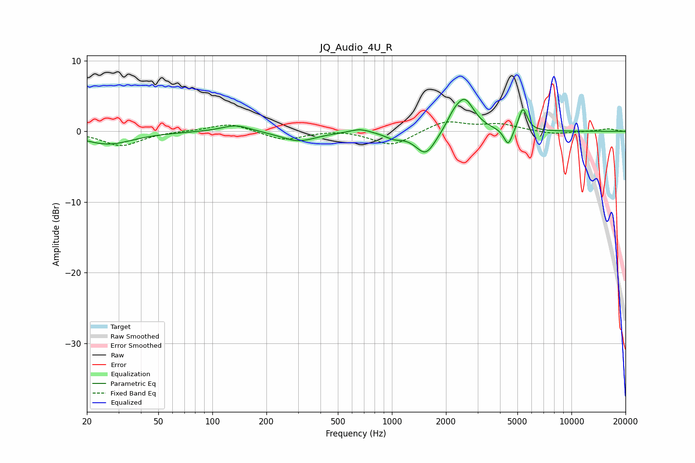

# JQ_Audio_4U_R
See [usage instructions](https://github.com/jaakkopasanen/AutoEq#usage) for more options and info.

### Parametric EQs
Apply preamp of -4.6 dB when using parametric equalizer.

|   # | Type    |   Fc (Hz) |    Q |   Gain (dB) |
|-----|---------|-----------|------|-------------|
|   1 | Peaking |        26 | 1.04 |        -1.8 |
|   2 | Peaking |       135 | 1.72 |         1   |
|   3 | Peaking |       302 | 1.46 |        -1.4 |
|   4 | Peaking |       663 | 2.62 |         0.6 |
|   5 | Peaking |      1025 | 2.9  |        -0.7 |
|   6 | Peaking |      1543 | 2.48 |        -3.4 |
|   7 | Peaking |      2197 | 3.82 |         1.2 |
|   8 | Peaking |      2543 | 2.64 |         4.5 |
|   9 | Peaking |      4443 | 5.97 |        -2.5 |
|  10 | Peaking |      5363 | 5.88 |         3.3 |

### Fixed Band EQs
When using fixed band (also called graphic) equalizer, apply preamp of **-1.4 dB** (if available) and set gains manually with these parameters.

|   # | Type    |   Fc (Hz) |    Q |   Gain (dB) |
|-----|---------|-----------|------|-------------|
|   1 | Peaking |        31 | 1.41 |        -2   |
|   2 | Peaking |        62 | 1.41 |         0.1 |
|   3 | Peaking |       125 | 1.41 |         1.2 |
|   4 | Peaking |       250 | 1.41 |        -1.3 |
|   5 | Peaking |       500 | 1.41 |         0.3 |
|   6 | Peaking |      1000 | 1.41 |        -2.1 |
|   7 | Peaking |      2000 | 1.41 |         1.5 |
|   8 | Peaking |      4000 | 1.41 |         1   |
|   9 | Peaking |      8000 | 1.41 |        -0.4 |
|  10 | Peaking |     16000 | 1.41 |         0.4 |

### Graphs

