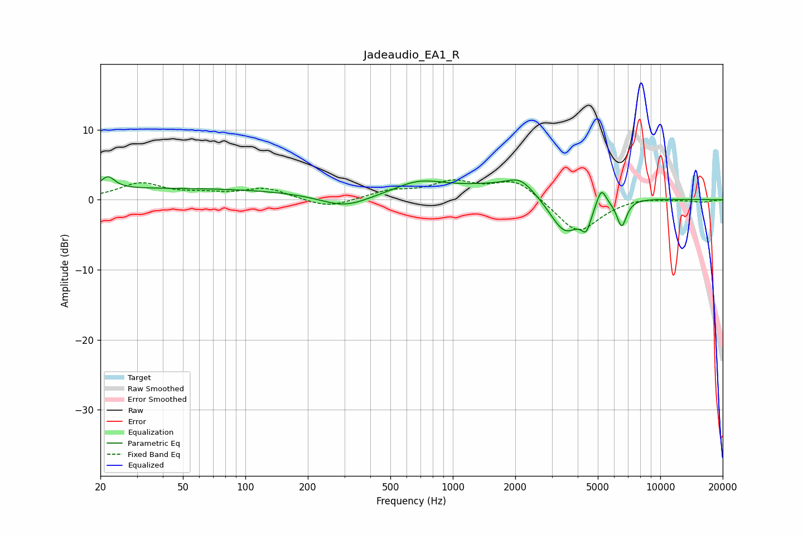

# Jadeaudio_EA1_R
See [usage instructions](https://github.com/jaakkopasanen/AutoEq#usage) for more options and info.

### Parametric EQs
Apply preamp of -3.4 dB when using parametric equalizer.

|   # | Type    |   Fc (Hz) |    Q |   Gain (dB) |
|-----|---------|-----------|------|-------------|
|   1 | Peaking |        22 | 4.37 |         1.8 |
|   2 | Peaking |        42 | 0.18 |         1.6 |
|   3 | Peaking |       300 | 1.22 |        -1.8 |
|   4 | Peaking |       683 | 1.16 |         1.9 |
|   5 | Peaking |      2111 | 2.35 |         1.6 |
|   6 | Peaking |      2188 | 0.47 |         2.5 |
|   7 | Peaking |      3479 | 1.68 |        -6.5 |
|   8 | Peaking |      4400 | 5.92 |        -2.8 |
|   9 | Peaking |      5200 | 6    |         2.6 |
|  10 | Peaking |      6520 | 5.74 |        -3.9 |

### Fixed Band EQs
When using fixed band (also called graphic) equalizer, apply preamp of **-2.9 dB** (if available) and set gains manually with these parameters.

|   # | Type    |   Fc (Hz) |    Q |   Gain (dB) |
|-----|---------|-----------|------|-------------|
|   1 | Peaking |        31 | 1.41 |         2.3 |
|   2 | Peaking |        62 | 1.41 |         0.7 |
|   3 | Peaking |       125 | 1.41 |         1.6 |
|   4 | Peaking |       250 | 1.41 |        -1.3 |
|   5 | Peaking |       500 | 1.41 |         1.1 |
|   6 | Peaking |      1000 | 1.41 |         2.3 |
|   7 | Peaking |      2000 | 1.41 |         2.9 |
|   8 | Peaking |      4000 | 1.41 |        -4.9 |
|   9 | Peaking |      8000 | 1.41 |         0.4 |
|  10 | Peaking |     16000 | 1.41 |        -0.3 |

### Graphs

