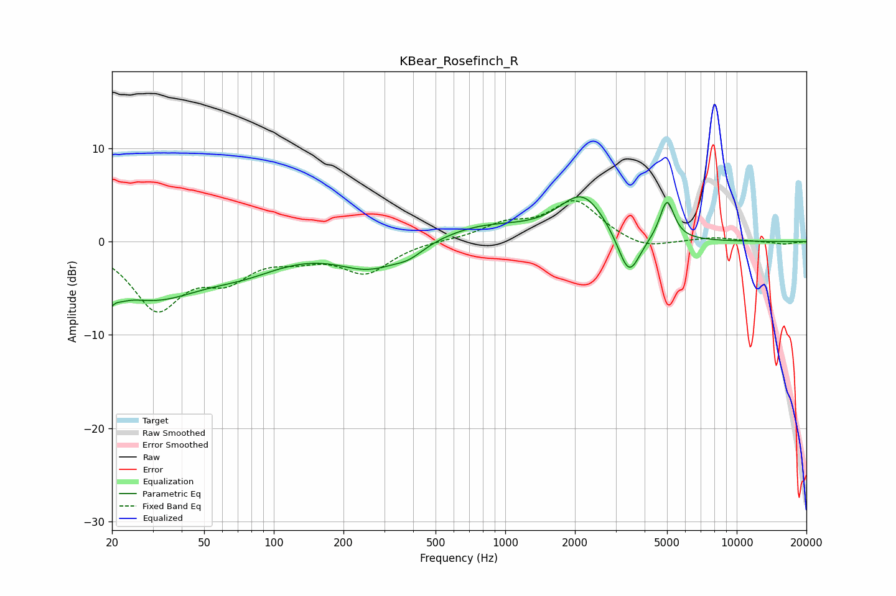

# KBear_Rosefinch_R
See [usage instructions](https://github.com/jaakkopasanen/AutoEq#usage) for more options and info.

### Parametric EQs
Apply preamp of -4.9 dB when using parametric equalizer.

|   # | Type    |   Fc (Hz) |    Q |   Gain (dB) |
|-----|---------|-----------|------|-------------|
|   1 | Peaking |        20 | 4.41 |        -5.7 |
|   2 | Peaking |        20 | 5.67 |         3.4 |
|   3 | Peaking |        30 | 0.64 |        -5.6 |
|   4 | Peaking |        75 | 0.83 |        -1.9 |
|   5 | Peaking |       260 | 1.02 |        -2.7 |
|   6 | Peaking |       384 | 2.21 |        -1   |
|   7 | Peaking |       788 | 0.7  |         1.7 |
|   8 | Peaking |      2158 | 1.38 |         4.9 |
|   9 | Peaking |      3421 | 2.9  |        -4.9 |
|  10 | Peaking |      4997 | 4.5  |         4.3 |

### Fixed Band EQs
When using fixed band (also called graphic) equalizer, apply preamp of **-4.5 dB** (if available) and set gains manually with these parameters.

|   # | Type    |   Fc (Hz) |    Q |   Gain (dB) |
|-----|---------|-----------|------|-------------|
|   1 | Peaking |        31 | 1.41 |        -6.9 |
|   2 | Peaking |        62 | 1.41 |        -3.3 |
|   3 | Peaking |       125 | 1.41 |        -1.2 |
|   4 | Peaking |       250 | 1.41 |        -3.2 |
|   5 | Peaking |       500 | 1.41 |         0.1 |
|   6 | Peaking |      1000 | 1.41 |         1.6 |
|   7 | Peaking |      2000 | 1.41 |         4.3 |
|   8 | Peaking |      4000 | 1.41 |        -1   |
|   9 | Peaking |      8000 | 1.41 |         0.4 |
|  10 | Peaking |     16000 | 1.41 |        -0.3 |

### Graphs

