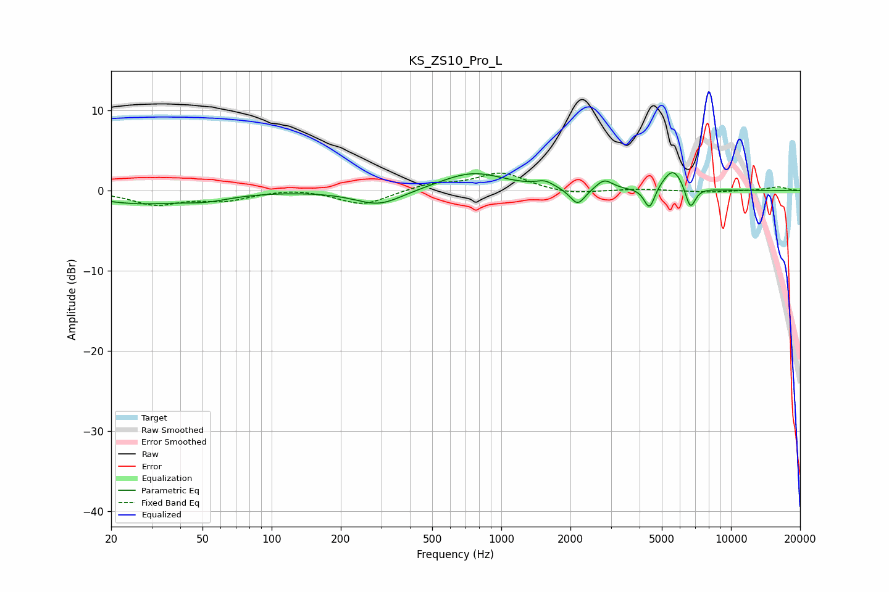

# KS_ZS10_Pro_L
See [usage instructions](https://github.com/jaakkopasanen/AutoEq#usage) for more options and info.

### Parametric EQs
Apply preamp of -2.3 dB when using parametric equalizer.

|   # | Type    |   Fc (Hz) |    Q |   Gain (dB) |
|-----|---------|-----------|------|-------------|
|   1 | Peaking |        26 | 0.72 |        -1.5 |
|   2 | Peaking |        52 | 1.32 |        -0.8 |
|   3 | Peaking |       293 | 1.35 |        -1.9 |
|   4 | Peaking |       750 | 0.99 |         2.3 |
|   5 | Peaking |      1549 | 3.66 |         0.7 |
|   6 | Peaking |      2149 | 4.31 |        -2.1 |
|   7 | Peaking |      2809 | 3.97 |         1.3 |
|   8 | Peaking |      4419 | 6    |        -2.8 |
|   9 | Peaking |      5613 | 2.87 |         2.9 |
|  10 | Peaking |      6650 | 6    |        -3.1 |

### Fixed Band EQs
When using fixed band (also called graphic) equalizer, apply preamp of **-2.3 dB** (if available) and set gains manually with these parameters.

|   # | Type    |   Fc (Hz) |    Q |   Gain (dB) |
|-----|---------|-----------|------|-------------|
|   1 | Peaking |        31 | 1.41 |        -1.6 |
|   2 | Peaking |        62 | 1.41 |        -1.1 |
|   3 | Peaking |       125 | 1.41 |         0.3 |
|   4 | Peaking |       250 | 1.41 |        -1.8 |
|   5 | Peaking |       500 | 1.41 |         0.8 |
|   6 | Peaking |      1000 | 1.41 |         2.2 |
|   7 | Peaking |      2000 | 1.41 |        -0.5 |
|   8 | Peaking |      4000 | 1.41 |         0.2 |
|   9 | Peaking |      8000 | 1.41 |        -0.2 |
|  10 | Peaking |     16000 | 1.41 |         0.5 |

### Graphs

