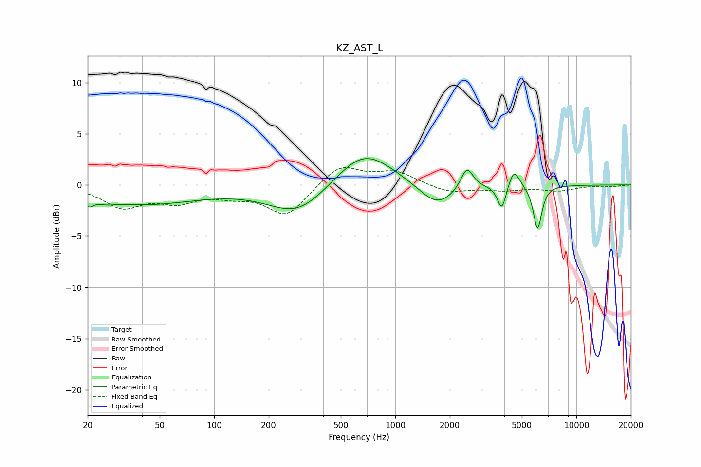

# KZ_AST_L
See [usage instructions](https://github.com/jaakkopasanen/AutoEq#usage) for more options and info.

### Parametric EQs
Apply preamp of -2.7 dB when using parametric equalizer.

|   # | Type    |   Fc (Hz) |    Q |   Gain (dB) |
|-----|---------|-----------|------|-------------|
|   1 | Peaking |        20 | 5.85 |        -0.7 |
|   2 | Peaking |        26 | 3.64 |        -0.2 |
|   3 | Peaking |        39 | 0.43 |        -1.8 |
|   4 | Peaking |       290 | 0.86 |        -2.9 |
|   5 | Peaking |       670 | 0.89 |         3.6 |
|   6 | Peaking |      1699 | 1.42 |        -2.3 |
|   7 | Peaking |      2485 | 4.12 |         2.2 |
|   8 | Peaking |      3874 | 5.96 |        -2.5 |
|   9 | Peaking |      4526 | 4.73 |         1.8 |
|  10 | Peaking |      6103 | 5.99 |        -4.3 |

### Fixed Band EQs
When using fixed band (also called graphic) equalizer, apply preamp of **-1.8 dB** (if available) and set gains manually with these parameters.

|   # | Type    |   Fc (Hz) |    Q |   Gain (dB) |
|-----|---------|-----------|------|-------------|
|   1 | Peaking |        31 | 1.41 |        -2.1 |
|   2 | Peaking |        62 | 1.41 |        -1.4 |
|   3 | Peaking |       125 | 1.41 |        -0.8 |
|   4 | Peaking |       250 | 1.41 |        -3   |
|   5 | Peaking |       500 | 1.41 |         2   |
|   6 | Peaking |      1000 | 1.41 |         1.2 |
|   7 | Peaking |      2000 | 1.41 |        -0.8 |
|   8 | Peaking |      4000 | 1.41 |        -0.5 |
|   9 | Peaking |      8000 | 1.41 |        -0.5 |
|  10 | Peaking |     16000 | 1.41 |        -0.1 |

### Graphs

