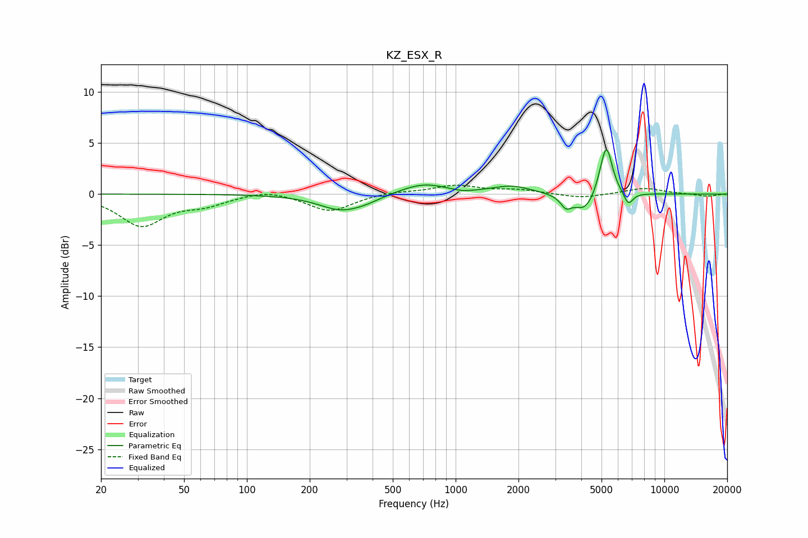

# KZ_ESX_R
See [usage instructions](https://github.com/jaakkopasanen/AutoEq#usage) for more options and info.

### Parametric EQs
Apply preamp of -4.4 dB when using parametric equalizer.

|   # | Type    |   Fc (Hz) |    Q |   Gain (dB) |
|-----|---------|-----------|------|-------------|
|   1 | Peaking |       285 | 1.3  |        -1.6 |
|   2 | Peaking |       376 | 2    |        -0.3 |
|   3 | Peaking |       700 | 1.21 |         1.1 |
|   4 | Peaking |      1073 | 2.57 |        -0.2 |
|   5 | Peaking |      1861 | 1.53 |         0.8 |
|   6 | Peaking |      3379 | 5.53 |        -1.1 |
|   7 | Peaking |      4168 | 2.61 |        -1.9 |
|   8 | Peaking |      5145 | 4.01 |         1.3 |
|   9 | Peaking |      5286 | 5.03 |         3.9 |
|  10 | Peaking |      6722 | 6    |        -1.3 |

### Fixed Band EQs
When using fixed band (also called graphic) equalizer, apply preamp of **-1.0 dB** (if available) and set gains manually with these parameters.

|   # | Type    |   Fc (Hz) |    Q |   Gain (dB) |
|-----|---------|-----------|------|-------------|
|   1 | Peaking |        31 | 1.41 |        -3   |
|   2 | Peaking |        62 | 1.41 |        -0.9 |
|   3 | Peaking |       125 | 1.41 |         0.5 |
|   4 | Peaking |       250 | 1.41 |        -1.7 |
|   5 | Peaking |       500 | 1.41 |         0.2 |
|   6 | Peaking |      1000 | 1.41 |         0.8 |
|   7 | Peaking |      2000 | 1.41 |         0.4 |
|   8 | Peaking |      4000 | 1.41 |        -0.4 |
|   9 | Peaking |      8000 | 1.41 |         0.6 |
|  10 | Peaking |     16000 | 1.41 |        -0.2 |

### Graphs

