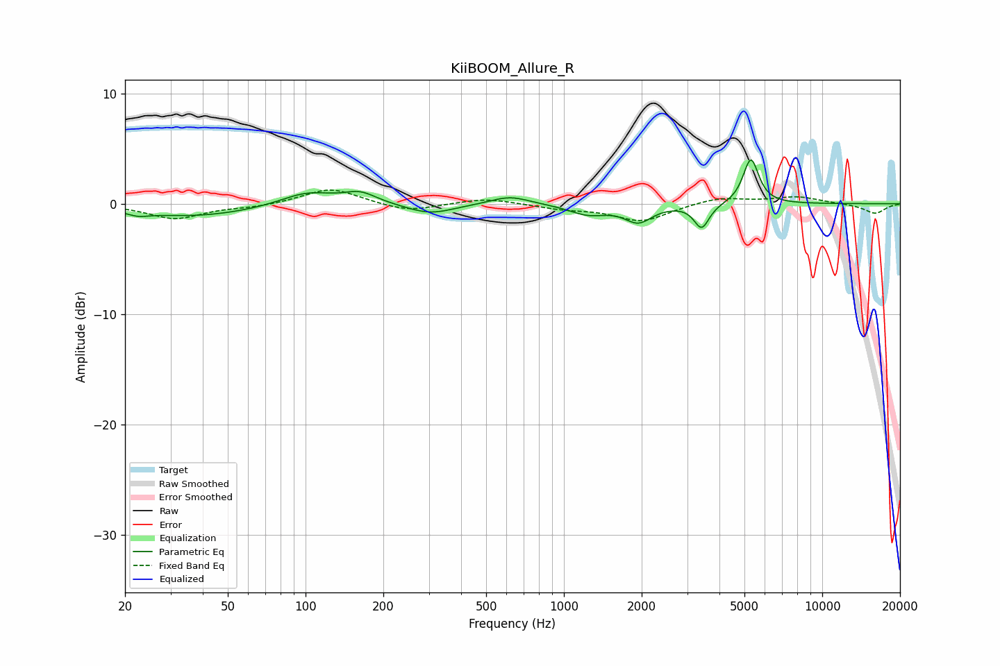

# KiiBOOM_Allure_R
See [usage instructions](https://github.com/jaakkopasanen/AutoEq#usage) for more options and info.

### Parametric EQs
Apply preamp of -4.1 dB when using parametric equalizer.

|   # | Type    |   Fc (Hz) |    Q |   Gain (dB) |
|-----|---------|-----------|------|-------------|
|   1 | Peaking |        23 | 3.63 |        -0.3 |
|   2 | Peaking |        37 | 0.58 |        -1.1 |
|   3 | Peaking |       101 | 1.36 |         1.2 |
|   4 | Peaking |       163 | 2.23 |         1   |
|   5 | Peaking |       304 | 1.53 |        -0.9 |
|   6 | Peaking |       618 | 1.89 |         0.8 |
|   7 | Peaking |      1238 | 1.94 |        -0.9 |
|   8 | Peaking |      1941 | 2.68 |        -1.5 |
|   9 | Peaking |      3414 | 4.88 |        -2.2 |
|  10 | Peaking |      5294 | 4.66 |         4.1 |

### Fixed Band EQs
When using fixed band (also called graphic) equalizer, apply preamp of **-1.3 dB** (if available) and set gains manually with these parameters.

|   # | Type    |   Fc (Hz) |    Q |   Gain (dB) |
|-----|---------|-----------|------|-------------|
|   1 | Peaking |        31 | 1.41 |        -1.3 |
|   2 | Peaking |        62 | 1.41 |        -0.3 |
|   3 | Peaking |       125 | 1.41 |         1.5 |
|   4 | Peaking |       250 | 1.41 |        -0.7 |
|   5 | Peaking |       500 | 1.41 |         0.5 |
|   6 | Peaking |      1000 | 1.41 |        -0.4 |
|   7 | Peaking |      2000 | 1.41 |        -1.6 |
|   8 | Peaking |      4000 | 1.41 |         0.6 |
|   9 | Peaking |      8000 | 1.41 |         0.6 |
|  10 | Peaking |     16000 | 1.41 |        -0.9 |

### Graphs

