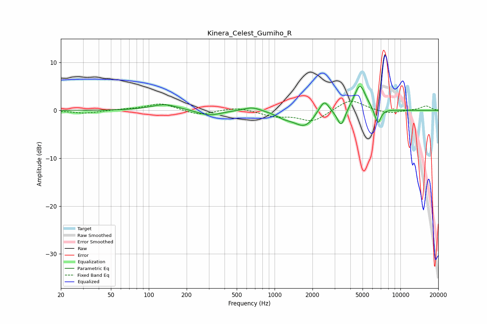

# Kinera_Celest_Gumiho_R
See [usage instructions](https://github.com/jaakkopasanen/AutoEq#usage) for more options and info.

### Parametric EQs
Apply preamp of -5.1 dB when using parametric equalizer.

|   # | Type    |   Fc (Hz) |    Q |   Gain (dB) |
|-----|---------|-----------|------|-------------|
|   1 | Peaking |       133 | 1.35 |         1.3 |
|   2 | Peaking |       303 | 1.57 |        -1.1 |
|   3 | Peaking |       663 | 1.99 |         0.9 |
|   4 | Peaking |      1192 | 2.18 |        -0.9 |
|   5 | Peaking |      1738 | 1.64 |        -3.3 |
|   6 | Peaking |      2230 | 3.21 |         0.7 |
|   7 | Peaking |      2492 | 3.96 |         2.6 |
|   8 | Peaking |      3383 | 4.57 |        -3.7 |
|   9 | Peaking |      4763 | 2.97 |         5.6 |
|  10 | Peaking |      6611 | 5.57 |        -3.4 |

### Fixed Band EQs
When using fixed band (also called graphic) equalizer, apply preamp of **-2.0 dB** (if available) and set gains manually with these parameters.

|   # | Type    |   Fc (Hz) |    Q |   Gain (dB) |
|-----|---------|-----------|------|-------------|
|   1 | Peaking |        31 | 1.41 |        -0.6 |
|   2 | Peaking |        62 | 1.41 |         0.2 |
|   3 | Peaking |       125 | 1.41 |         1.5 |
|   4 | Peaking |       250 | 1.41 |        -1   |
|   5 | Peaking |       500 | 1.41 |         0.7 |
|   6 | Peaking |      1000 | 1.41 |        -1.1 |
|   7 | Peaking |      2000 | 1.41 |        -2.3 |
|   8 | Peaking |      4000 | 1.41 |         2.4 |
|   9 | Peaking |      8000 | 1.41 |        -0.8 |
|  10 | Peaking |     16000 | 1.41 |         0.9 |

### Graphs

