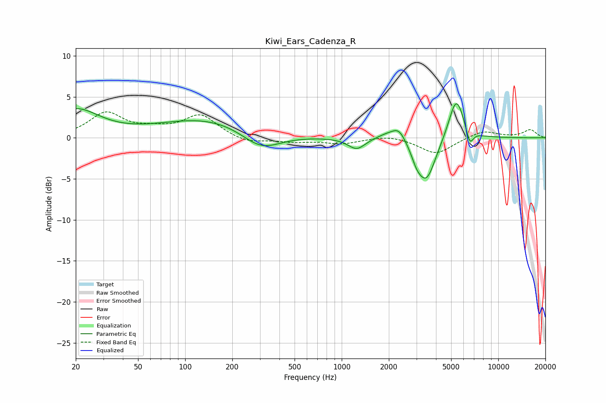

# Kiwi_Ears_Cadenza_R
See [usage instructions](https://github.com/jaakkopasanen/AutoEq#usage) for more options and info.

### Parametric EQs
Apply preamp of -4.3 dB when using parametric equalizer.

|   # | Type    |   Fc (Hz) |    Q |   Gain (dB) |
|-----|---------|-----------|------|-------------|
|   1 | Peaking |        20 | 0.94 |         3.3 |
|   2 | Peaking |       141 | 0.45 |         2.4 |
|   3 | Peaking |       305 | 1.11 |        -2.4 |
|   4 | Peaking |      1245 | 2.59 |        -1.4 |
|   5 | Peaking |      1953 | 2.02 |         0.7 |
|   6 | Peaking |      2325 | 3.16 |         1.5 |
|   7 | Peaking |      3007 | 4.5  |        -1   |
|   8 | Peaking |      3464 | 2.29 |        -5.4 |
|   9 | Peaking |      5393 | 2.82 |         5.3 |
|  10 | Peaking |      6576 | 6    |        -1.9 |

### Fixed Band EQs
When using fixed band (also called graphic) equalizer, apply preamp of **-3.3 dB** (if available) and set gains manually with these parameters.

|   # | Type    |   Fc (Hz) |    Q |   Gain (dB) |
|-----|---------|-----------|------|-------------|
|   1 | Peaking |        31 | 1.41 |         2.9 |
|   2 | Peaking |        62 | 1.41 |         0.8 |
|   3 | Peaking |       125 | 1.41 |         2.7 |
|   4 | Peaking |       250 | 1.41 |        -0.7 |
|   5 | Peaking |       500 | 1.41 |        -0.4 |
|   6 | Peaking |      1000 | 1.41 |        -0.7 |
|   7 | Peaking |      2000 | 1.41 |         0.4 |
|   8 | Peaking |      4000 | 1.41 |        -2   |
|   9 | Peaking |      8000 | 1.41 |         0.9 |
|  10 | Peaking |     16000 | 1.41 |         1   |

### Graphs

